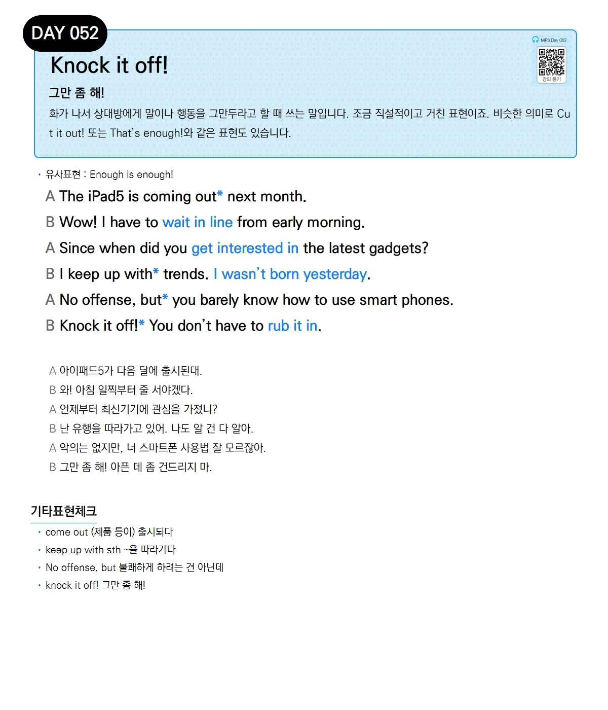

# Day 052 — Knock it off!

> **그만 좀 해!**

## 설명
화가 나서 상대방에게 말이나 행동을 그만두라고 할 때 쓰는 말입니다. 조금 직설적이고 거친 표현이죠. 비슷한 의미로 `Cut it out!` 또는 `That's enough!`와 같은 표현도 있습니다.

- **유사표현**: Enough is enough!

## 대화

| | English | 한국어 |
|---|---------|--------|
| A | The iPad5 is coming out next month. | 아이패드5가 다음 달에 출시된대. |
| B | Wow! I have to wait in line from early morning. | 와! 아침 일찍부터 줄 서야겠다. |
| A | Since when did you get interested in the latest gadgets? | 언제부터 최신기기에 관심을 가졌니? |
| B | I keep up with trends. I wasn't born yesterday. | 난 유행을 따라가고 있어. 나도 알 건 다 알아. |
| A | No offense, but you barely know how to use smart phones. | 악의는 없지만, 너 스마트폰 사용법 잘 모르잖아. |
| B | Knock it off! You don't have to rub it in. | 그만 좀 해! 아픈 데 좀 건드리지 마. |

## 기타표현 체크
- **come out** (제품 등이) 출시되다
- **keep up with sth** ~을 따라가다
- **No offense, but** 불쾌하게 하려는 건 아닌데
- **knock it off!** 그만 좀 해!
