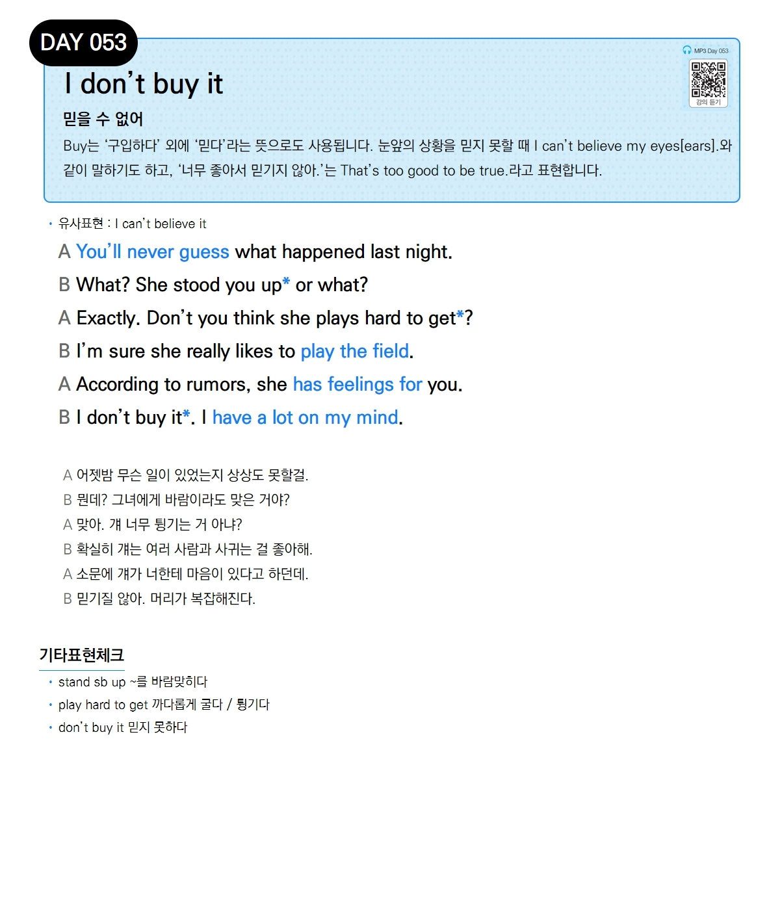

# Day 053 — I don't buy it

> **믿을 수 없어**

## 설명
`buy`는 '구입하다' 외에 '믿다'라는 뜻으로도 사용됩니다. 눈앞의 상황을 믿지 못할 때 `I can't believe my eyes[ears].`와 같이 말하기도 하고, '너무 좋아서 믿기지 않아.'는 `That's too good to be true.`라고 표현합니다.

- **유사표현**: I can't believe it

## 대화

| | English | 한국어 |
|---|---------|--------|
| A | You'll never guess what happened last night. | 어젯밤 무슨 일이 있었는지 상상도 못할걸. |
| B | What? She stood you up or what? | 뭔데? 그녀에게 바람이라도 맞은 거야? |
| A | Exactly. Don't you think she plays hard to get? | 맞아. 걔 너무 튕기는 거 아냐? |
| B | I'm sure she really likes to play the field. | 확실히 걔는 여러 사람과 사귀는 걸 좋아해. |
| A | According to rumors, she has feelings for you. | 소문에 걔가 너한테 마음이 있다고 하던데. |
| B | I don't buy it. I have a lot on my mind. | 믿기질 않아. 머리가 복잡해진다. |

## 기타표현 체크
- **stand sb up** ~를 바람맞히다
- **play hard to get** 까다롭게 굴다 / 튕기다
- **don't buy it** 믿지 못하다
