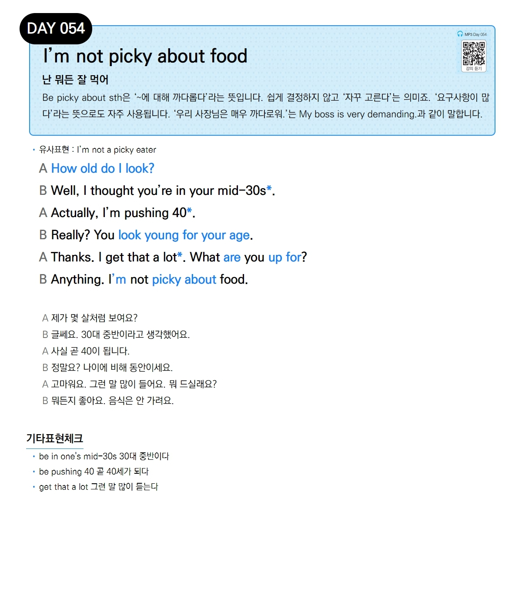

# Day 054 — I'm not picky about food

> **난 뭐든 잘 먹어**

## 설명
`be picky about sth`은 '~에 대해 까다롭다'라는 뜻입니다. 쉽게 결정하지 않고 '자꾸 고른다'는 의미죠. '요구사항이 많다'라는 뜻으로도 자주 사용됩니다. '우리 사장님은 매우 까다로워.'는 `My boss is very demanding.`과 같이 말합니다.

- **유사표현**: I'm not a picky eater

## 대화

| | English | 한국어 |
|---|---------|--------|
| A | How old do I look? | 제가 몇 살처럼 보여요? |
| B | Well, I thought you're in your mid-30s. | 글쎄요. 30대 중반이라고 생각했어요. |
| A | Actually, I'm pushing 40. | 사실 곧 40이 됩니다. |
| B | Really? You look young for your age. | 정말요? 나이에 비해 동안이세요. |
| A | Thanks. I get that a lot. What are you up for? | 고마워요. 그런 말 많이 들어요. 뭐 드실래요? |
| B | Anything. I'm not picky about food. | 뭐든지 좋아요. 음식은 안 가려요. |

## 기타표현 체크
- **be in one's mid-30s** 30대 중반이다
- **be pushing 40** 곧 40세가 되다
- **get that a lot** 그런 말 많이 듣는다
