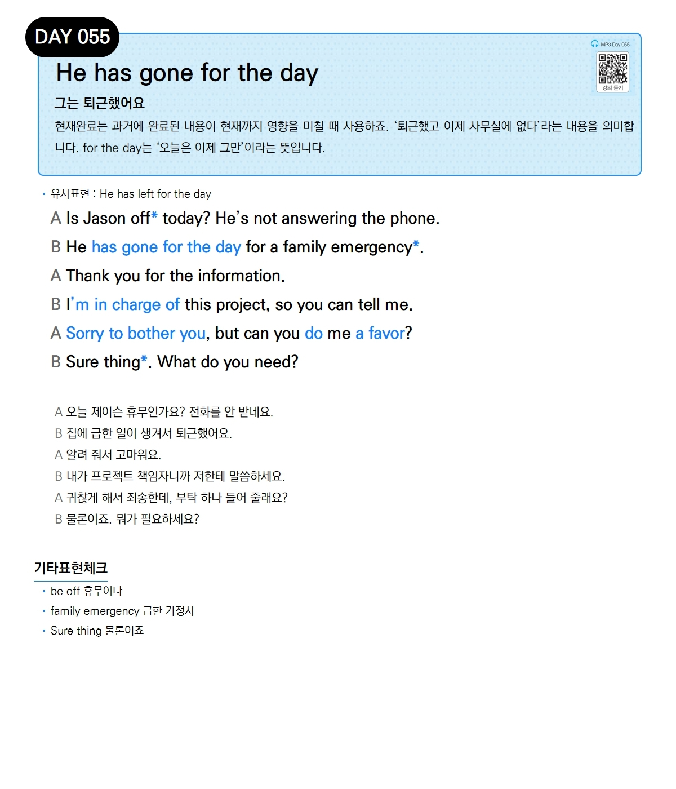

# Day 055 — He has gone for the day

> **그는 퇴근했어요**

## 설명
현재완료는 과거에 완료된 내용이 현재까지 영향을 미칠 때 사용하죠. '퇴근했고 이제 사무실에 없다'라는 내용을 의미합니다. `for the day`는 '오늘은 이제 그만'이라는 뜻입니다.

- **유사표현**: He has left for the day

## 대화

| | English | 한국어 |
|---|---------|--------|
| A | Is Jason off today? He's not answering the phone. | 오늘 제이슨 휴무인가요? 전화를 안 받네요. |
| B | He has gone for the day for a family emergency. | 집에 급한 일이 생겨서 퇴근했어요. |
| A | Thank you for the information. | 알려 줘서 고마워요. |
| B | I'm in charge of this project, so you can tell me. | 내가 프로젝트 책임자니까 저한테 말씀하세요. |
| A | Sorry to bother you, but can you do me a favor? | 귀찮게 해서 죄송한데, 부탁 하나 들어 줄래요? |
| B | Sure thing. What do you need? | 물론이죠. 뭐가 필요하세요? |

## 기타표현 체크
- **be off** 휴무이다
- **family emergency** 급한 가정사
- **Sure thing** 물론이죠
