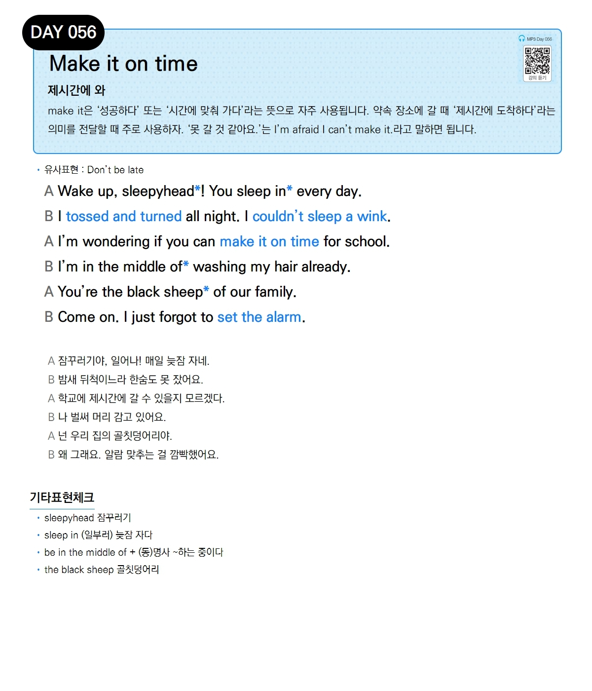

# Day 056 — Make it on time

> **제시간에 와**

## 설명
`make it`은 '성공하다' 또는 '시간에 맞춰 가다'라는 뜻으로 자주 사용됩니다. 약속 장소에 갈 때 '제시간에 도착하다'라는 의미를 전달할 때 주로 사용합니다. '못 갈 것 같아요.'는 `I'm afraid I can't make it.`라고 말하면 됩니다.

- **유사표현**: Don't be late

## 대화

| | English | 한국어 |
|---|---------|--------|
| A | Wake up, sleepyhead! You sleep in every day. | 잠꾸러기야, 일어나! 매일 늦잠 자네. |
| B | I tossed and turned all night. I couldn't sleep a wink. | 밤새 뒤척이느라 한숨도 못 잤어요. |
| A | I'm wondering if you can make it on time for school. | 학교에 제시간에 갈 수 있을지 모르겠다. |
| B | I'm in the middle of washing my hair already. | 나 벌써 머리 감고 있어요. |
| A | You're the black sheep of our family. | 넌 우리 집의 골칫덩어리야. |
| B | Come on. I just forgot to set the alarm. | 왜 그래요. 알람 맞추는 걸 깜빡했어요. |

## 기타표현 체크
- **sleepyhead** 잠꾸러기
- **sleep in** (일부러) 늦잠 자다
- **be in the middle of + (동)명사** ~하는 중이다
- **the black sheep** 골칫덩어리
