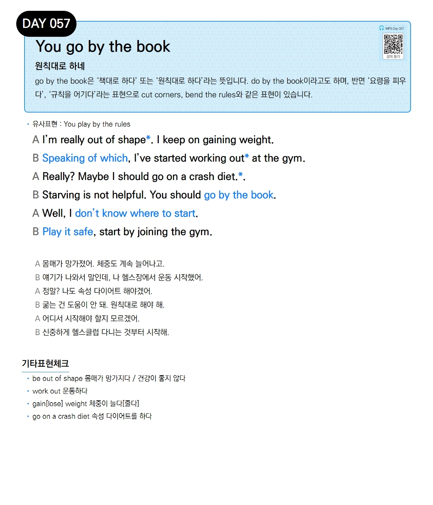

# Day 057 — You go by the book

> **원칙대로 하네**

## 설명
`go by the book`은 '책대로 하다' 또는 '원칙대로 하다'라는 뜻입니다. `do by the book`이라고도 하며, 반면 '요령을 피우다', '규칙을 어기다'라는 표현으로 `cut corners`, `bend the rules`와 같은 표현이 있습니다.

- **유사표현**: You play by the rules

## 대화

| | English | 한국어 |
|---|---------|--------|
| A | I'm really out of shape. I keep on gaining weight. | 몸매가 망가졌어. 체중도 계속 늘어나고. |
| B | Speaking of which, I've started working out at the gym. | 얘기가 나와서 말인데, 나 헬스장에서 운동 시작했어. |
| A | Really? Maybe I should go on a crash diet. | 정말? 나도 속성 다이어트 해야겠어. |
| B | Starving is not helpful. You should go by the book. | 굶는 건 도움이 안 돼. 원칙대로 해야 해. |
| A | Well, I don't know where to start. | 어디서 시작해야 할지 모르겠어. |
| B | Play it safe, start by joining the gym. | 신중하게 헬스클럽 다니는 것부터 시작해. |

## 기타표현 체크
- **be out of shape** 몸매가 망가지다 / 건강이 좋지 않다
- **work out** 운동하다
- **gain[lose] weight** 체중이 늘다[줄다]
- **go on a crash diet** 속성 다이어트를 하다
