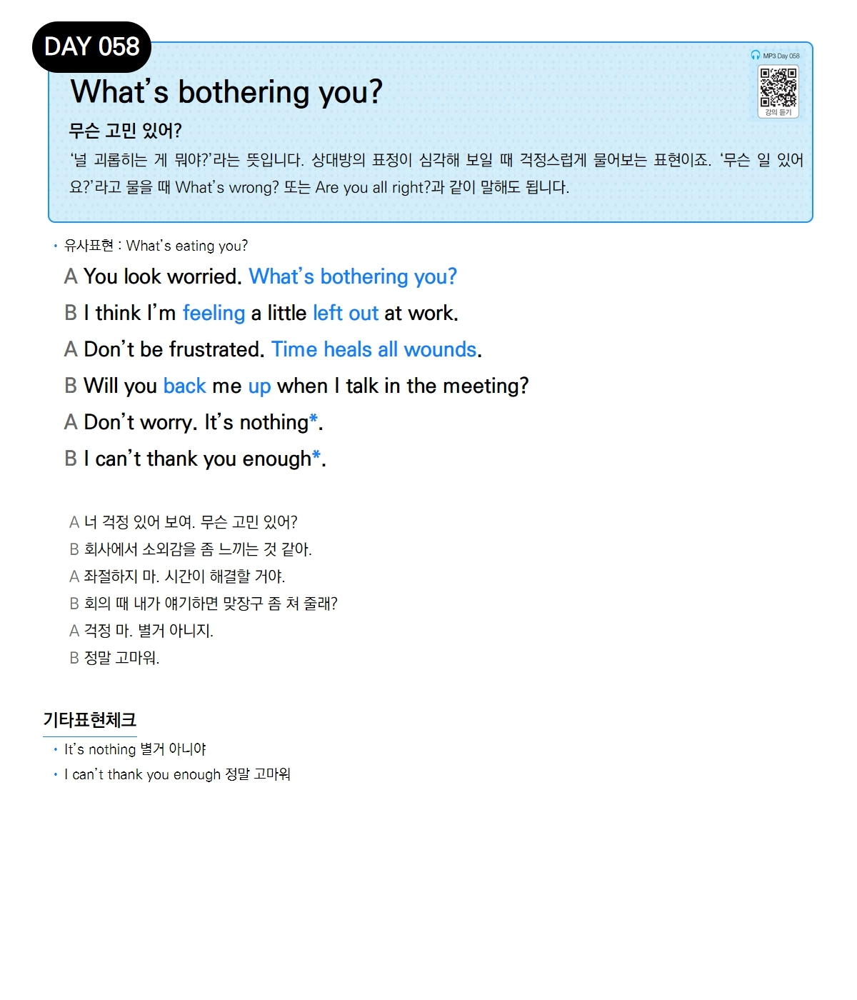

# Day 058 — What's bothering you?

> **무슨 고민 있어?**

## 설명
'널 괴롭히는 게 뭐야?'라는 뜻입니다. 상대방의 표정이 심각해 보일 때 걱정스럽게 물어보는 표현이죠. '무슨 일 있어요?'라고 물을 때 `What's wrong?` 또는 `Are you all right?`과 같이 말해도 됩니다.

- **유사표현**: What's eating you?

## 대화

| | English | 한국어 |
|---|---------|--------|
| A | You look worried. What's bothering you? | 너 걱정 있어 보여. 무슨 고민 있어? |
| B | I think I'm feeling a little left out at work. | 회사에서 소외감을 좀 느끼는 것 같아. |
| A | Don't be frustrated. Time heals all wounds. | 좌절하지 마. 시간이 해결할 거야. |
| B | Will you back me up when I talk in the meeting? | 회의 때 내가 얘기하면 맞장구 좀 쳐 줄래? |
| A | Don't worry. It's nothing. | 걱정 마. 별거 아니지. |
| B | I can't thank you enough. | 정말 고마워. |

## 기타표현 체크
- **It's nothing** 별거 아니야
- **I can't thank you enough** 정말 고마워
