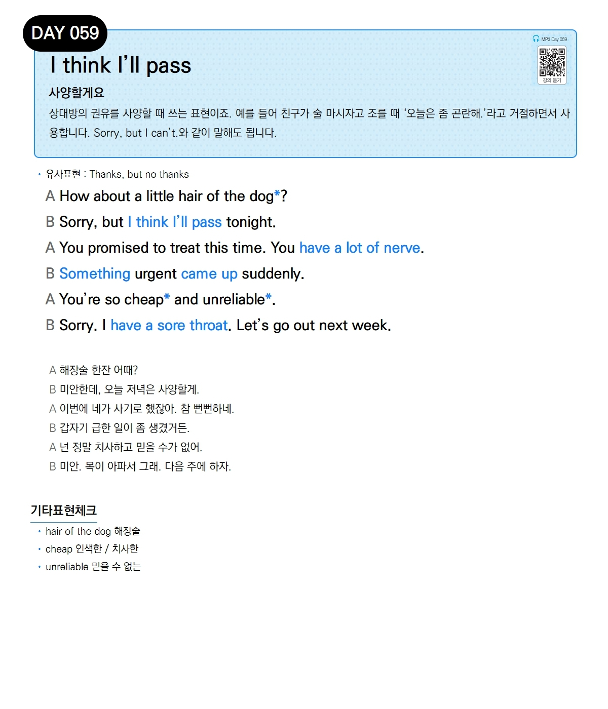

# Day 059 — I think I'll pass

> **사양할게요**

## 설명
상대방의 권유를 사양할 때 쓰는 표현이죠. 예를 들어 친구가 술 마시자고 조를 때 '오늘은 좀 곤란해.'라고 거절하면서 사용합니다. `Sorry, but I can't.`와 같이 말해도 됩니다.

- **유사표현**: Thanks, but no thanks

## 대화

| | English | 한국어 |
|---|---------|--------|
| A | How about a little hair of the dog? | 해장술 한잔 어때? |
| B | Sorry, but I think I'll pass tonight. | 미안한데, 오늘 저녁은 사양할게. |
| A | You promised to treat this time. You have a lot of nerve. | 이번에 네가 사기로 했잖아. 참 뻔뻔하네. |
| B | Something urgent came up suddenly. | 갑자기 급한 일이 좀 생겼거든. |
| A | You're so cheap and unreliable. | 넌 정말 치사하고 믿을 수가 없어. |
| B | Sorry. I have a sore throat. Let's go out next week. | 미안. 목이 아파서 그래. 다음 주에 하자. |

## 기타표현 체크
- **hair of the dog** 해장술
- **cheap** 인색한 / 치사한
- **unreliable** 믿을 수 없는
