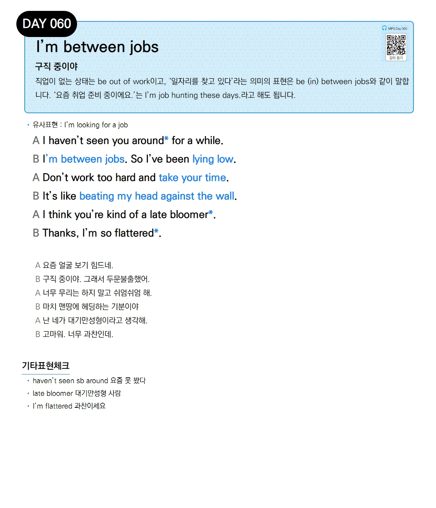

# Day 060 — I'm between jobs

> **구직 중이야**

## 설명
직업이 없는 상태는 `be out of work`이고, '일자리를 찾고 있다'라는 의미의 표현은 `be (in) between jobs`와 같이 말합니다. '요즘 취업 준비 중이에요.'는 `I'm job hunting these days.`라고 해도 됩니다.

- **유사표현**: I'm looking for a job

## 대화

| | English | 한국어 |
|---|---------|--------|
| A | I haven't seen you around for a while. | 요즘 얼굴 보기 힘드네. |
| B | I'm between jobs. So I've been lying low. | 구직 중이야. 그래서 두문불출했어. |
| A | Don't work too hard and take your time. | 너무 무리는 하지 말고 쉬엄쉬엄 해. |
| B | It's like beating my head against the wall. | 마치 맨땅에 헤딩하는 기분이야. |
| A | I think you're kind of a late bloomer. | 난 네가 대기만성형이라고 생각해. |
| B | Thanks, I'm so flattered. | 고마워. 너무 과찬인데. |

## 기타표현 체크
- **haven't seen sb around** 요즘 못 봤다
- **late bloomer** 대기만성형 사람
- **I'm flattered** 과찬이세요
