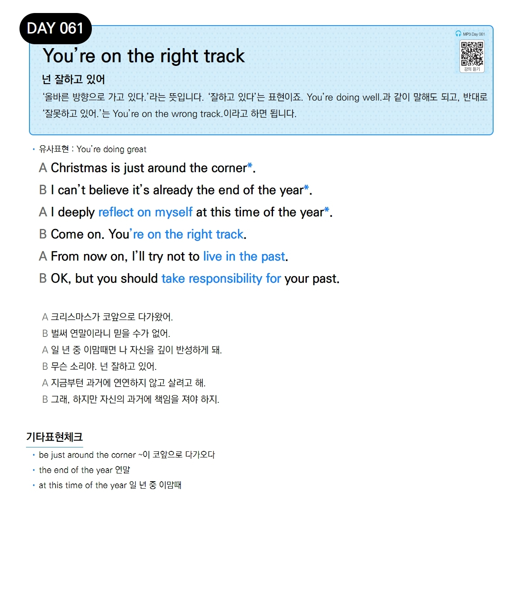

# Day 061 — You're on the right track

> **넌 잘하고 있어**

## 설명
'올바른 방향으로 가고 있다.'라는 뜻입니다. '잘하고 있다'는 표현이죠. `You're doing well.`과 같이 말해도 되고, 반대로 '잘못하고 있어.'는 `You're on the wrong track.`이라고 하면 됩니다.

- **유사표현**: You're doing great

## 대화

| | English | 한국어 |
|---|---------|--------|
| A | Christmas is just around the corner. | 크리스마스가 코앞으로 다가왔어. |
| B | I can't believe it's already the end of the year. | 벌써 연말이라니 믿을 수가 없어. |
| A | I deeply reflect on myself at this time of the year. | 일 년 중 이맘때면 나 자신을 깊이 반성하게 돼. |
| B | Come on. You're on the right track. | 무슨 소리야. 넌 잘하고 있어. |
| A | From now on, I'll try not to live in the past. | 지금부턴 과거에 연연하지 않고 살려고 해. |
| B | OK, but you should take responsibility for your past. | 그래, 하지만 자신의 과거에 책임을 져야 하지. |

## 기타표현 체크
- **be just around the corner** ~이 코앞으로 다가오다
- **the end of the year** 연말
- **at this time of the year** 일 년 중 이맘때
