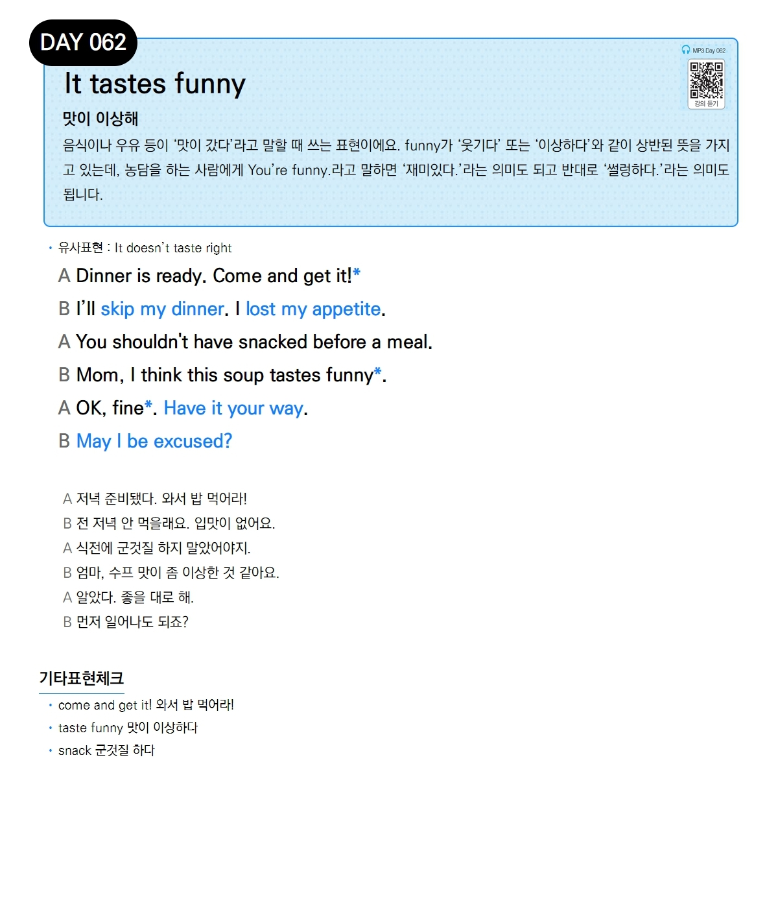

# Day 062 — It tastes funny

> **맛이 이상해**

## 설명
음식이나 우유 등이 '맛이 갔다'라고 말할 때 쓰는 표현이에요. `funny`가 '웃기다' 또는 '이상하다'와 같이 상반된 뜻을 가지고 있는데, 농담을 하는 사람에게 `You're funny.`라고 말하면 '재미있다.'라는 의미도 되고 반대로 '썰렁하다.'라는 의미도 됩니다.

- **유사표현**: It doesn't taste right

## 대화

| | English | 한국어 |
|---|---------|--------|
| A | Dinner is ready. Come and get it! | 저녁 준비됐다. 와서 밥 먹어라! |
| B | I'll skip my dinner. I lost my appetite. | 전 저녁 안 먹을래요. 입맛이 없어요. |
| A | You shouldn't have snacked before a meal. | 식전에 군것질 하지 말았어야지. |
| B | Mom, I think this soup tastes funny. | 엄마, 수프 맛이 좀 이상한 것 같아요. |
| A | OK, fine. Have it your way. | 알았다. 좋을 대로 해. |
| B | May I be excused? | 먼저 일어나도 되죠? |

## 기타표현 체크
- **come and get it!** 와서 밥 먹어라!
- **taste funny** 맛이 이상하다
- **snack** 군것질 하다
