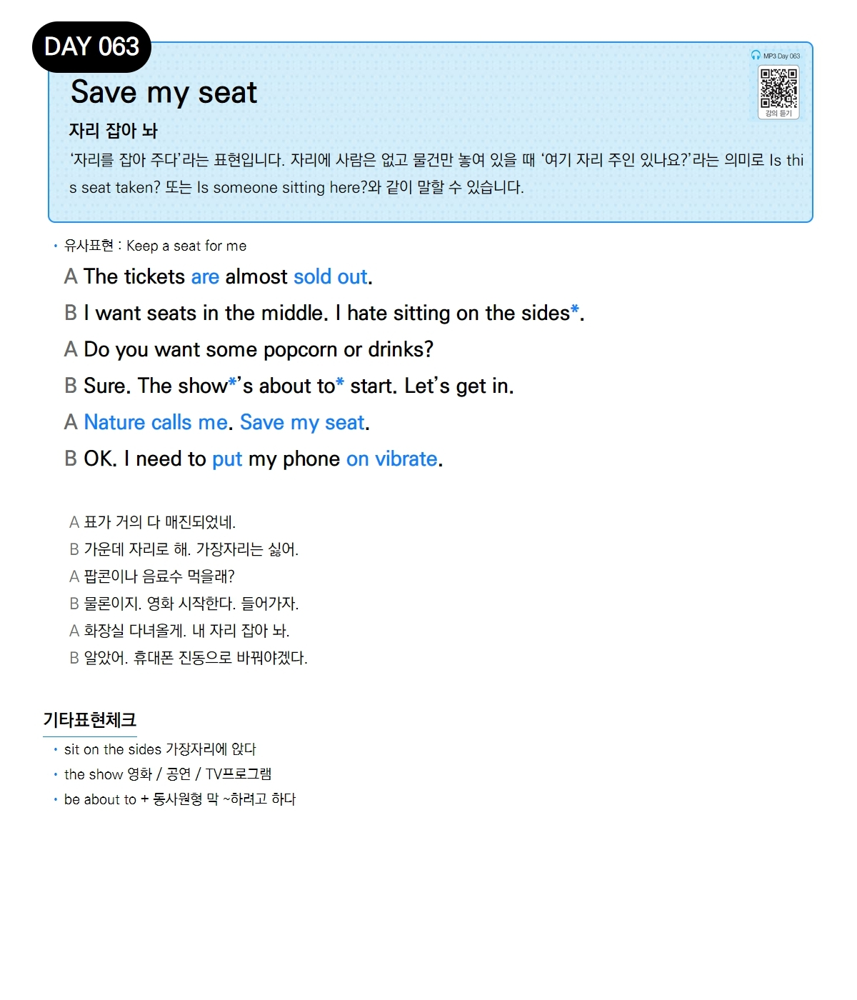

# Day 063 — Save my seat

> **자리 잡아 놔**

## 설명
'자리를 잡아 주다'라는 표현입니다. 자리에 사람은 없고 물건만 놓여 있을 때 '여기 자리 주인 있나요?'라는 의미로 `Is this seat taken?` 또는 `Is someone sitting here?`와 같이 말할 수 있습니다.

- **유사표현**: Keep a seat for me

## 대화

| | English | 한국어 |
|---|---------|--------|
| A | The tickets are almost sold out. | 표가 거의 다 매진되었네. |
| B | I want seats in the middle. I hate sitting on the sides. | 가운데 자리로 해. 가장자리는 싫어. |
| A | Do you want some popcorn or drinks? | 팝콘이나 음료수 먹을래? |
| B | Sure. The show's about to start. Let's get in. | 물론이지. 영화 시작한다. 들어가자. |
| A | Nature calls me. Save my seat. | 화장실 다녀올게. 내 자리 잡아 놔. |
| B | OK. I need to put my phone on vibrate. | 알았어. 휴대폰 진동으로 바꿔야겠다. |

## 기타표현 체크
- **sit on the sides** 가장자리에 앉다
- **the show** 영화 / 공연 / TV프로그램
- **be about to + 동사원형** 막 ~하려고 하다
