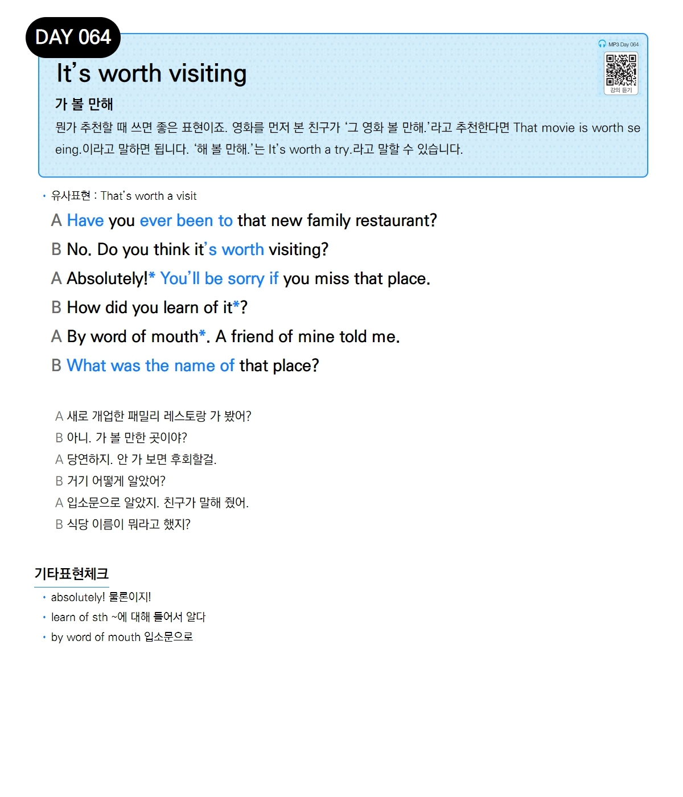

# Day 064 — It's worth visiting

> **가 볼 만해**

## 설명
뭔가 추천할 때 쓰면 좋은 표현이죠. 영화를 먼저 본 친구가 '그 영화 볼 만해.'라고 추천한다면 `That movie is worth seeing.`이라고 말하면 됩니다. '해 볼 만해.'는 `It's worth a try.`라고 말할 수 있습니다.

- **유사표현**: That's worth a visit

## 대화

| | English | 한국어 |
|---|---------|--------|
| A | Have you ever been to that new family restaurant? | 새로 개업한 패밀리 레스토랑 가 봤어? |
| B | No. Do you think it's worth visiting? | 아니. 가 볼 만한 곳이야? |
| A | Absolutely! You'll be sorry if you miss that place. | 당연하지. 안 가 보면 후회할걸. |
| B | How did you learn of it? | 거기 어떻게 알았어? |
| A | By word of mouth. A friend of mine told me. | 입소문으로 알았지. 친구가 말해 줬어. |
| B | What was the name of that place? | 식당 이름이 뭐라고 했지? |

## 기타표현 체크
- **absolutely!** 물론이지!
- **learn of sth** ~에 대해 들어서 알다
- **by word of mouth** 입소문으로
