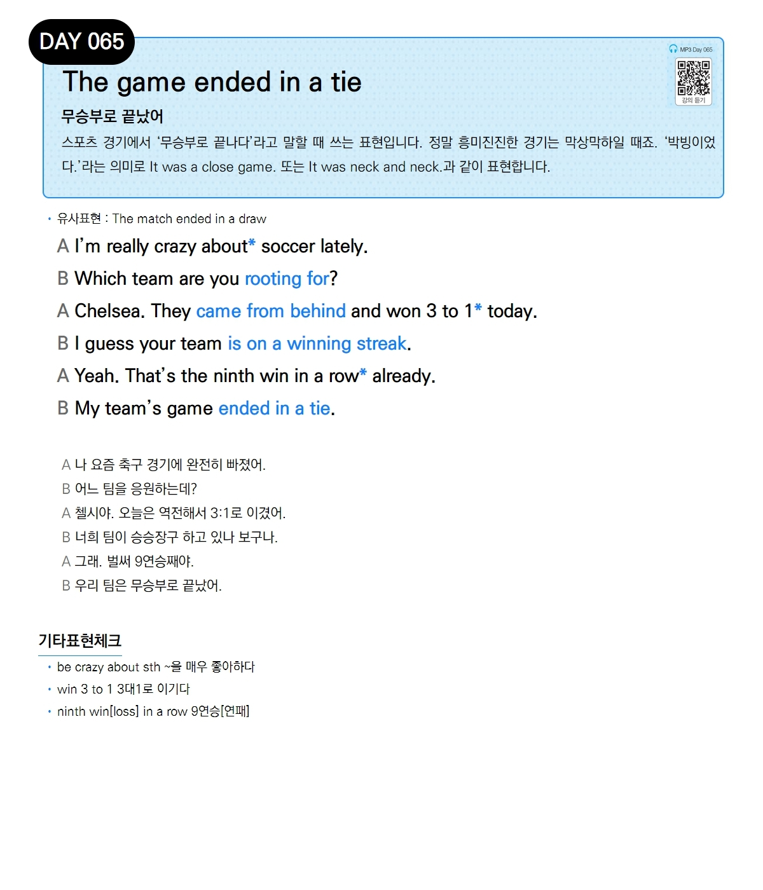

# Day 065 — The game ended in a tie

> **무승부로 끝났어**

## 설명
스포츠 경기에서 '무승부로 끝나다'라고 말할 때 쓰는 표현입니다. 정말 흥미진진한 경기는 막상막하일 때죠. '박빙이었다.'라는 의미로 `It was a close game.` 또는 `It was neck and neck.`과 같이 표현합니다.

- **유사표현**: The match ended in a draw

## 대화

| | English | 한국어 |
|---|---------|--------|
| A | I'm really crazy about soccer lately. | 나 요즘 축구 경기에 완전히 빠졌어. |
| B | Which team are you rooting for? | 어느 팀을 응원하는데? |
| A | Chelsea. They came from behind and won 3 to 1 today. | 첼시야. 오늘은 역전해서 3:1로 이겼어. |
| B | I guess your team is on a winning streak. | 너희 팀이 승승장구 하고 있나 보구나. |
| A | Yeah. That's the ninth win in a row already. | 그래. 벌써 9연승째야. |
| B | My team's game ended in a tie. | 우리 팀은 무승부로 끝났어. |

## 기타표현 체크
- **be crazy about sth** ~을 매우 좋아하다
- **win 3 to 1** 3대1로 이기다
- **ninth win[loss] in a row** 9연승[연패]
