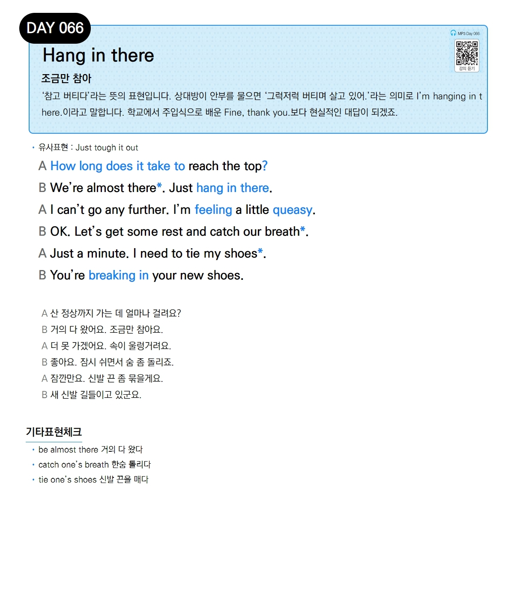

# Day 066 — Hang in there

> **조금만 참아**

## 설명
'참고 버티다'라는 뜻의 표현입니다. 상대방이 안부를 물으면 '그럭저럭 버티며 살고 있어.'라는 의미로 `I'm hanging in there.`이라고 말합니다. 학교에서 주입식으로 배운 `Fine, thank you.`보다 현실적인 대답이 되겠죠.

- **유사표현**: Just tough it out

## 대화

| | English | 한국어 |
|---|---------|--------|
| A | How long does it take to reach the top? | 산 정상까지 가는 데 얼마나 걸려요? |
| B | We're almost there. Just hang in there. | 거의 다 왔어요. 조금만 참아요. |
| A | I can't go any further. I'm feeling a little queasy. | 더 못 가겠어요. 속이 울렁거려요. |
| B | OK. Let's get some rest and catch our breath. | 좋아요. 잠시 쉬면서 숨 좀 돌리죠. |
| A | Just a minute. I need to tie my shoes. | 잠깐만요. 신발 끈 좀 묶을게요. |
| B | You're breaking in your new shoes. | 새 신발 길들이고 있군요. |

## 기타표현 체크
- **be almost there** 거의 다 왔다
- **catch one's breath** 한숨 돌리다
- **tie one's shoes** 신발 끈을 매다
