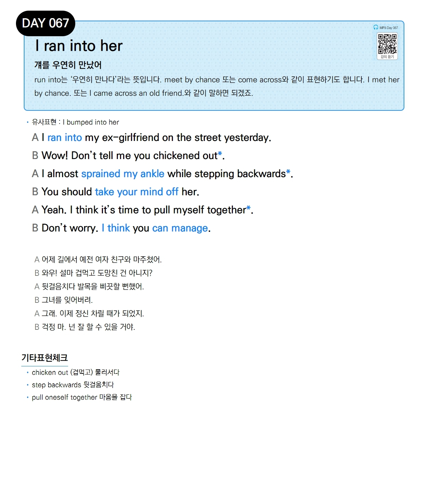

# Day 067 — I ran into her

> **걔를 우연히 만났어**

## 설명
`run into`는 '우연히 만나다'라는 뜻입니다. `meet by chance` 또는 `come across`와 같이 표현하기도 합니다. `I met her by chance.` 또는 `I came across an old friend.`와 같이 말하면 되겠죠.

- **유사표현**: I bumped into her

## 대화

| | English | 한국어 |
|---|---------|--------|
| A | I ran into my ex-girlfriend on the street yesterday. | 어제 길에서 예전 여자 친구와 마주쳤어. |
| B | Wow! Don't tell me you chickened out. | 와우! 설마 겁먹고 도망친 건 아니지? |
| A | I almost sprained my ankle while stepping backwards. | 뒷걸음치다 발목을 삐끗할 뻔했어. |
| B | You should take your mind off her. | 그녀를 잊어버려. |
| A | Yeah. I think it's time to pull myself together. | 그래. 이제 정신 차릴 때가 되었지. |
| B | Don't worry. I think you can manage. | 걱정 마. 넌 잘 할 수 있을 거야. |

## 기타표현 체크
- **chicken out** (겁먹고) 물러서다
- **step backwards** 뒷걸음치다
- **pull oneself together** 마음을 잡다
