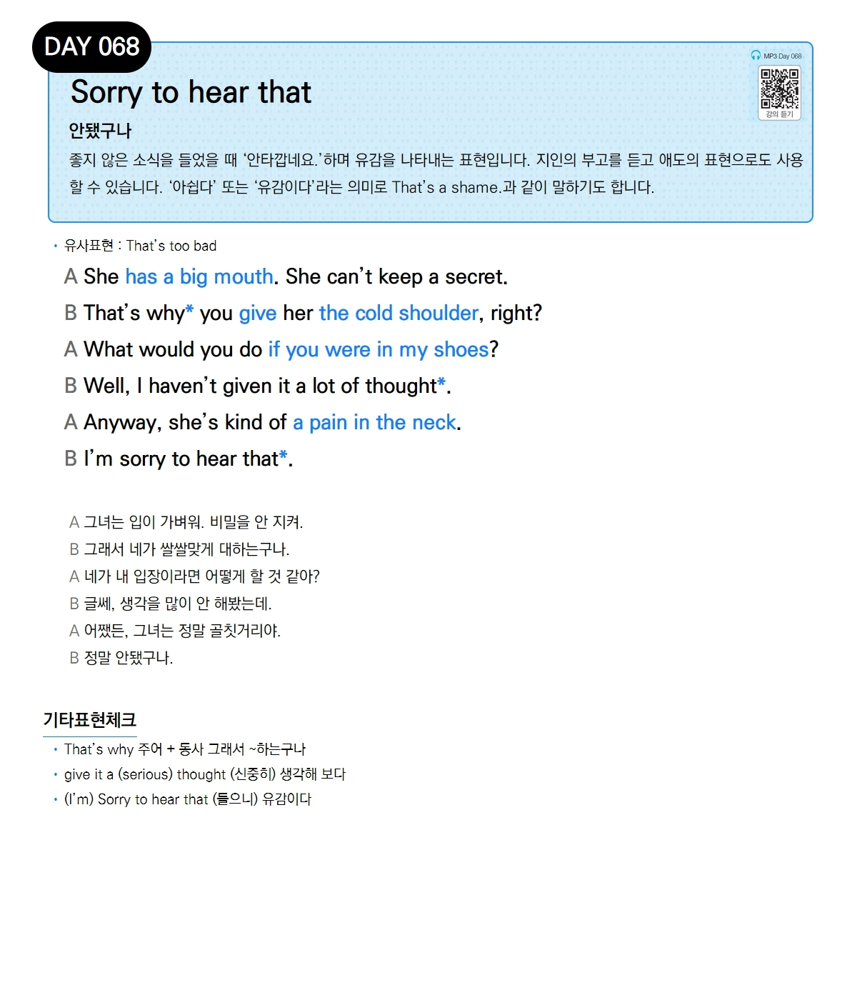

# Day 068 — Sorry to hear that

> **안됐구나**

## 설명
좋지 않은 소식을 들었을 때 '안타깝네요.'하며 유감을 나타내는 표현입니다. 지인의 부고를 듣고 애도의 표현으로도 사용할 수 있습니다. '아쉽다' 또는 '유감이다'라는 의미로 `That's a shame.`과 같이 말하기도 합니다.

- **유사표현**: That's too bad

## 대화

| | English | 한국어 |
|---|---------|--------|
| A | She has a big mouth. She can't keep a secret. | 그녀는 입이 가벼워. 비밀을 안 지켜. |
| B | That's why you give her the cold shoulder, right? | 그래서 네가 쌀쌀맞게 대하는구나. |
| A | What would you do if you were in my shoes? | 네가 내 입장이라면 어떻게 할 것 같아? |
| B | Well, I haven't given it a lot of thought. | 글쎄, 생각을 많이 안 해봤는데. |
| A | Anyway, she's kind of a pain in the neck. | 어쨌든, 그녀는 정말 골칫거리야. |
| B | I'm sorry to hear that. | 정말 안됐구나. |

## 기타표현 체크
- **That's why 주어 + 동사** 그래서 ~하는구나
- **give it a (serious) thought** (신중히) 생각해 보다
- **(I'm) Sorry to hear that** (들으니) 유감이다
