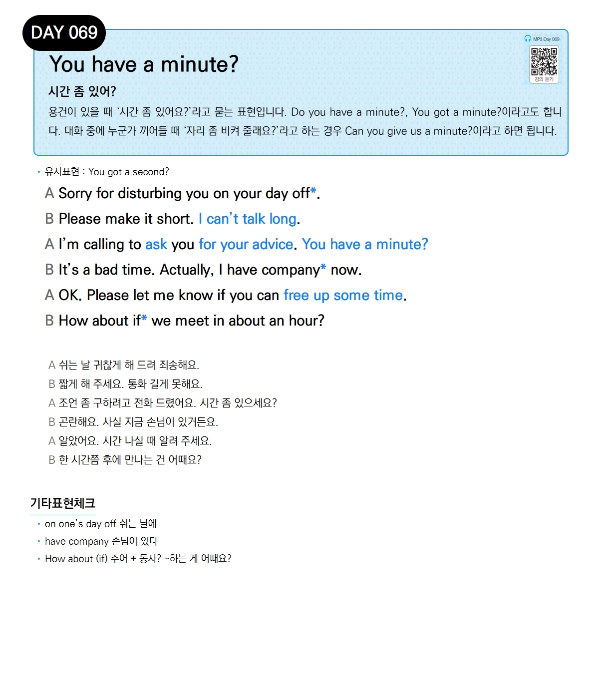

# Day 069 — You have a minute?

> **시간 좀 있어?**

## 설명
용건이 있을 때 '시간 좀 있어요?'라고 묻는 표현입니다. Do you have a minute?, You got a minute?이라고도 합니다. 대화 중에 누군가 끼어들 때 '자리 좀 비켜 줄래요?'라고 하는 경우 Can you give us a minute?이라고 하면 됩니다.

- **유사표현**: You got a second?

## 대화

| | English | 한국어 |
|---|---------|--------|
| A | Sorry for disturbing you on your day off. | 쉬는 날 귀찮게 해 드려 죄송해요. |
| B | Please make it short. I can't talk long. | 짧게 해 주세요. 통화 길게 못해요. |
| A | I'm calling to ask you for your advice. You have a minute? | 조언 좀 구하려고 전화 드렸어요. 시간 좀 있으세요? |
| B | It's a bad time. Actually, I have company now. | 곤란해요. 사실 지금 손님이 있거든요. |
| A | OK. Please let me know if you can free up some time. | 알았어요. 시간 나실 때 알려 주세요. |
| B | How about if we meet in about an hour? | 한 시간쯤 후에 만나는 건 어때요? |

## 기타표현 체크
- **on one's day off** 쉬는 날에
- **have company** 손님이 있다
- **How about (if) 주어 + 동사?** ~하는 게 어때요?
