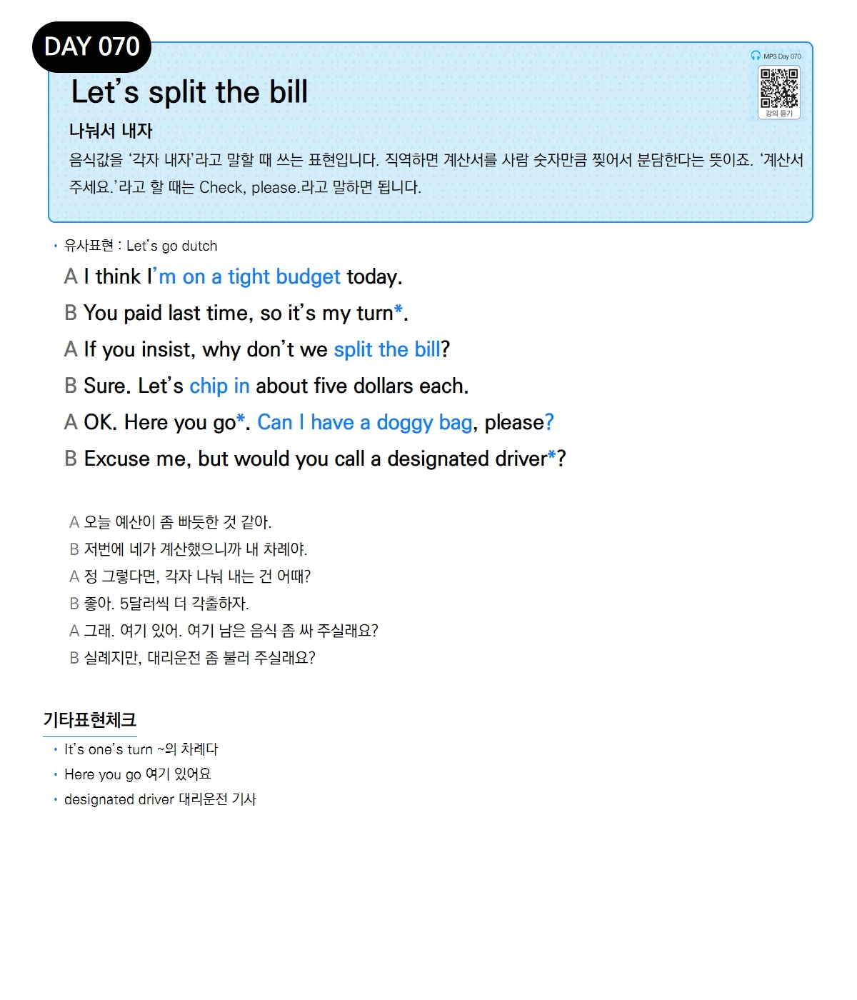

# Day 070 — Let's split the bill

> **나눠서 내자**

## 설명
음식값을 '각자 내자'라고 말할 때 쓰는 표현입니다. 직역하면 계산서를 사람 숫자만큼 찢어서 분담한다는 뜻이죠. '계산서 주세요.'라고 할 때는 Check, please.라고 말하면 됩니다.

- **유사표현**: Let's go dutch

## 대화

| | English | 한국어 |
|---|---------|--------|
| A | I think I'm on a tight budget today. | 오늘 예산이 좀 빠듯한 것 같아. |
| B | You paid last time, so it's my turn. | 저번에 네가 계산했으니까 내 차례야. |
| A | If you insist, why don't we split the bill? | 정 그렇다면, 각자 나눠 내는 건 어때? |
| B | Sure. Let's chip in about five dollars each. | 좋아. 5달러씩 더 갹출하자. |
| A | OK. Here you go. Can I have a doggy bag, please? | 그래. 여기 있어. 여기 남은 음식 좀 싸 주실래요? |
| B | Excuse me, but would you call a designated driver? | 실례지만, 대리운전 좀 불러 주실래요? |

## 기타표현 체크
- **It's one's turn** ~의 차례다
- **Here you go** 여기 있어요
- **designated driver** 대리운전 기사
