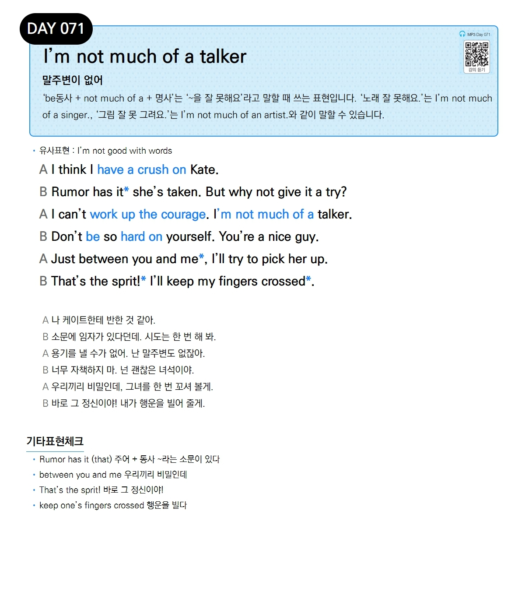

# Day 071 — I'm not much of a talker

> **말주변이 없어**

## 설명
'be동사 + not much of a + 명사'는 '~을 잘 못해요'라고 말할 때 쓰는 표현입니다. '노래 잘 못해요.'는 I'm not much of a singer., '그림 잘 못 그려요.'는 I'm not much of an artist.와 같이 말할 수 있습니다.

- **유사표현**: I'm not good with words

## 대화

| | English | 한국어 |
|---|---------|--------|
| A | I think I have a crush on Kate. | 나 케이트한테 반한 것 같아. |
| B | Rumor has it she's taken. But why not give it a try? | 소문에 임자가 있다던데. 시도는 한 번 해 봐. |
| A | I can't work up the courage. I'm not much of a talker. | 용기를 낼 수가 없어. 난 말주변도 없잖아. |
| B | Don't be so hard on yourself. You're a nice guy. | 너무 자책하지 마. 넌 괜찮은 녀석이야. |
| A | Just between you and me, I'll try to pick her up. | 우리끼리 비밀인데, 그녀를 한 번 꼬셔 볼게. |
| B | That's the spirit! I'll keep my fingers crossed. | 바로 그 정신이야! 내가 행운을 빌어 줄게. |

## 기타표현 체크
- **Rumor has it (that) 주어 + 동사** ~라는 소문이 있다
- **between you and me** 우리끼리 비밀인데
- **That's the spirit!** 바로 그 정신이야!
- **keep one's fingers crossed** 행운을 빌다
