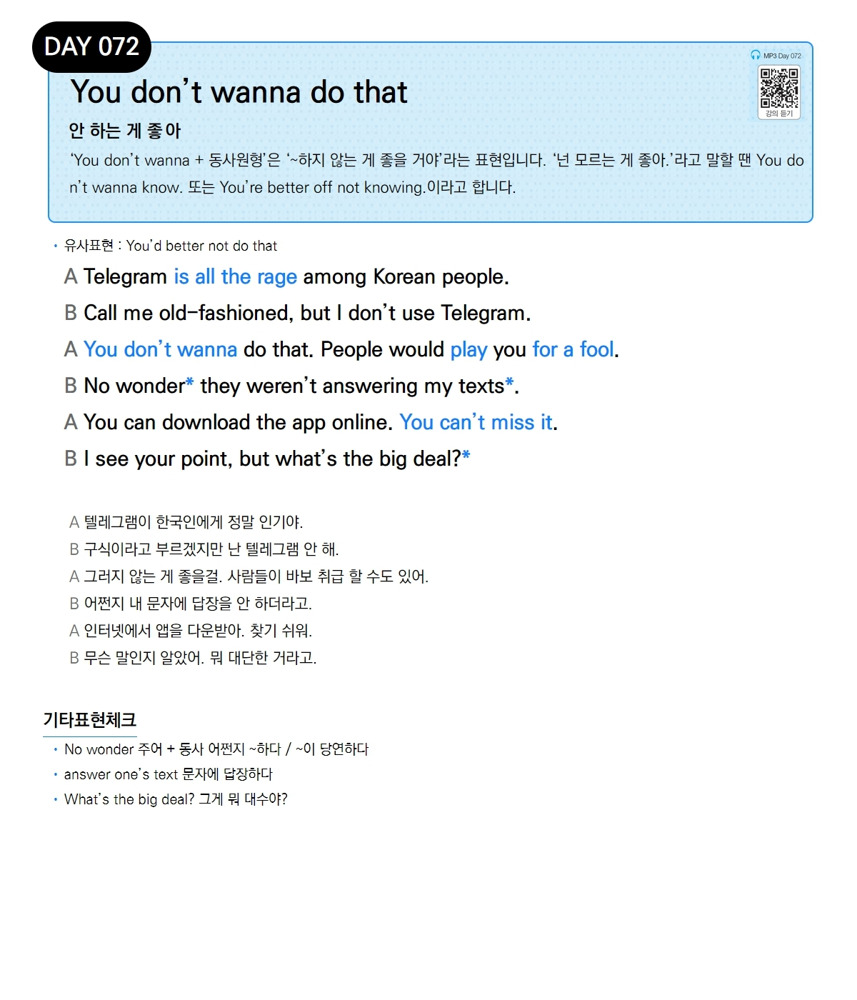

# Day 072 — You don't wanna do that

> **안 하는 게 좋아**

## 설명
'You don't wanna + 동사원형'은 '~하지 않는 게 좋을 거야'라는 표현입니다. '넌 모르는 게 좋아.'라고 말할 땐 You don't wanna know. 또는 You're better off not knowing.이라고 합니다.

- **유사표현**: You'd better not do that

## 대화

| | English | 한국어 |
|---|---------|--------|
| A | Telegram is all the rage among Korean people. | 텔레그램이 한국인에게 정말 인기야. |
| B | Call me old-fashioned, but I don't use Telegram. | 구식이라고 부르겠지만 난 텔레그램 안 해. |
| A | You don't wanna do that. People would play you for a fool. | 그러지 않는 게 좋을걸. 사람들이 바보 취급 할 수도 있어. |
| B | No wonder they weren't answering my texts. | 어쩐지 내 문자에 답장을 안 하더라고. |
| A | You can download the app online. You can't miss it. | 인터넷에서 앱을 다운받아. 찾기 쉬워. |
| B | I see your point, but what's the big deal? | 무슨 말인지 알았어. 뭐 대단한 거라고. |

## 기타표현 체크
- **No wonder 주어 + 동사** 어쩐지 ~하다 / ~이 당연하다
- **answer one's text** 문자에 답장하다
- **What's the big deal?** 그게 뭐 대수야?
