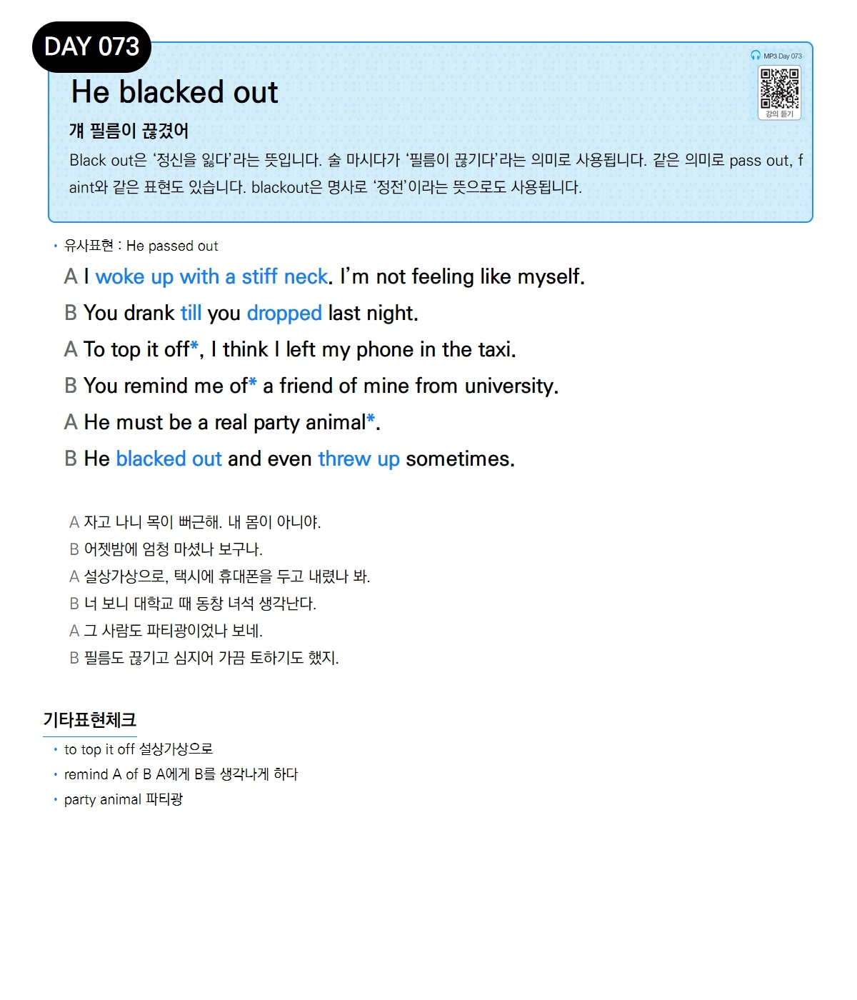

# Day 073 — He blacked out

> **걔 필름이 끊겼어**

## 설명
Black out은 '정신을 잃다'라는 뜻입니다. 술 마시다가 '필름이 끊기다'라는 의미로 사용됩니다. 같은 의미로 pass out, faint와 같은 표현도 있습니다. blackout은 명사로 '정전'이라는 뜻으로도 사용됩니다.

- **유사표현**: He passed out

## 대화

| | English | 한국어 |
|---|---------|--------|
| A | I woke up with a stiff neck. I'm not feeling like myself. | 자고 나니 목이 뻐근해. 내 몸이 아니야. |
| B | You drank till you dropped last night. | 어젯밤에 엄청 마셨나 보구나. |
| A | To top it off, I think I left my phone in the taxi. | 설상가상으로, 택시에 휴대폰을 두고 내렸나 봐. |
| B | You remind me of a friend of mine from university. | 너 보니 대학교 때 동창 녀석 생각난다. |
| A | He must be a real party animal. | 그 사람도 파티광이었나 보네. |
| B | He blacked out and even threw up sometimes. | 필름도 끊기고 심지어 가끔 토하기도 했지. |

## 기타표현 체크
- **to top it off** 설상가상으로
- **remind A of B** A에게 B를 생각나게 하다
- **party animal** 파티광
