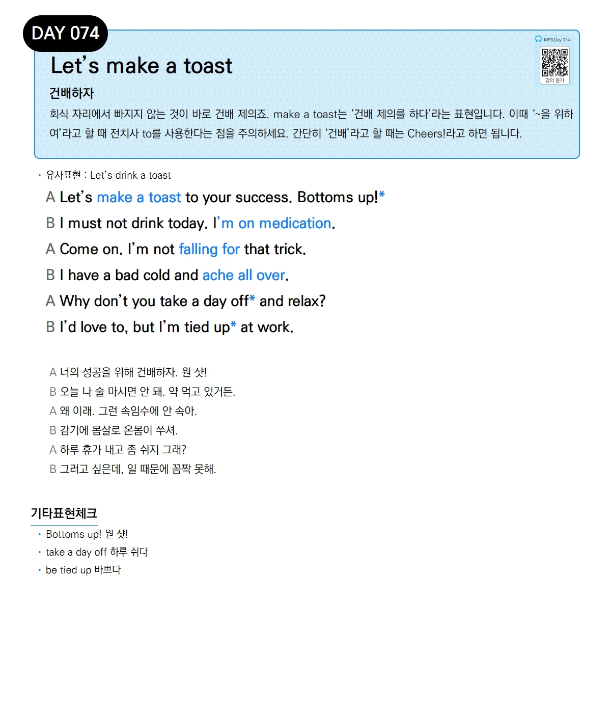

# Day 074 — Let's make a toast

> **건배하자**

## 설명
회식 자리에서 빠지지 않는 것이 바로 건배 제의죠. make a toast는 '건배 제의를 하다'라는 표현입니다. 이때 '~을 위하여'라고 할 때 전치사 to를 사용한다는 점을 주의하세요. 간단히 '건배'라고 할 때는 Cheers!라고 하면 됩니다.

- **유사표현**: Let's drink a toast

## 대화

| | English | 한국어 |
|---|---------|--------|
| A | Let's make a toast to your success. Bottoms up! | 너의 성공을 위해 건배하자. 원 샷! |
| B | I must not drink today. I'm on medication. | 오늘 나 술 마시면 안 돼. 약 먹고 있거든. |
| A | Come on. I'm not falling for that trick. | 왜 이래. 그런 속임수에 안 속아. |
| B | I have a bad cold and ache all over. | 감기에 몸살로 온몸이 쑤셔. |
| A | Why don't you take a day off and relax? | 하루 휴가 내고 좀 쉬지 그래? |
| B | I'd love to, but I'm tied up at work. | 그러고 싶은데, 일 때문에 꼼짝 못해. |

## 기타표현 체크
- **Bottoms up!** 원 샷!
- **take a day off** 하루 쉬다
- **be tied up** 바쁘다
