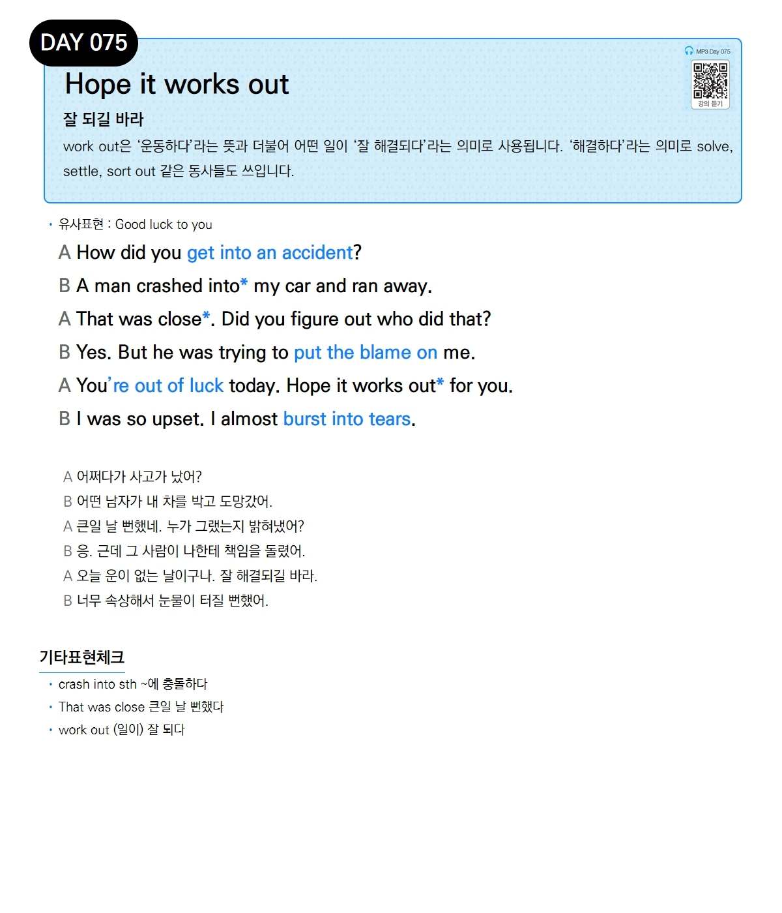

# Day 075 — Hope it works out

> **잘 되길 바라**

## 설명
work out은 '운동하다'라는 뜻과 더불어 어떤 일이 '잘 해결되다'라는 의미로 사용됩니다. '해결하다'라는 의미로 solve, settle, sort out 같은 동사들도 쓰입니다.

- **유사표현**: Good luck to you

## 대화

| | English | 한국어 |
|---|---------|--------|
| A | How did you get into an accident? | 어쩌다가 사고가 났어? |
| B | A man crashed into my car and ran away. | 어떤 남자가 내 차를 박고 도망갔어. |
| A | That was close. Did you figure out who did that? | 큰일 날 뻔했네. 누가 그랬는지 밝혀냈어? |
| B | Yes. But he was trying to put the blame on me. | 응. 근데 그 사람이 나한테 책임을 돌렸어. |
| A | You're out of luck today. Hope it works out for you. | 오늘 운이 없는 날이구나. 잘 해결되길 바라. |
| B | I was so upset. I almost burst into tears. | 너무 속상해서 눈물이 터질 뻔했어. |

## 기타표현 체크
- **crash into sth** ~에 충돌하다
- **That was close** 큰일 날 뻔했다
- **work out** (일이) 잘 되다
