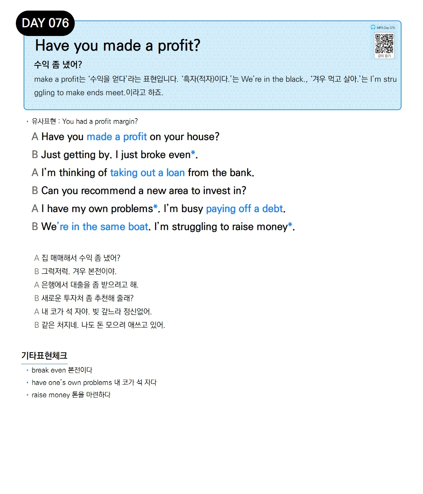

# Day 076 — Have you made a profit?

> **수익 좀 냈어?**

## 설명
make a profit는 '수익을 얻다'라는 표현입니다. '흑자(적자)이다.'는 We're in the black., '겨우 먹고 살아.'는 I'm struggling to make ends meet.이라고 하죠.

- **유사표현**: You had a profit margin?

## 대화

| | English | 한국어 |
|---|---------|--------|
| A | Have you made a profit on your house? | 집 매매해서 수익 좀 냈어? |
| B | Just getting by. I just broke even. | 그럭저럭. 겨우 본전이야. |
| A | I'm thinking of taking out a loan from the bank. | 은행에서 대출을 좀 받으려고 해. |
| B | Can you recommend a new area to invest in? | 새로운 투자처 좀 추천해 줄래? |
| A | I have my own problems. I'm busy paying off a debt. | 내 코가 석 자야. 빚 갚느라 정신없어. |
| B | We're in the same boat. I'm struggling to raise money. | 같은 처지네. 나도 돈 모으려 애쓰고 있어. |

## 기타표현 체크
- **break even** 본전이다
- **have one's own problems** 내 코가 석 자다
- **raise money** 돈을 마련하다
