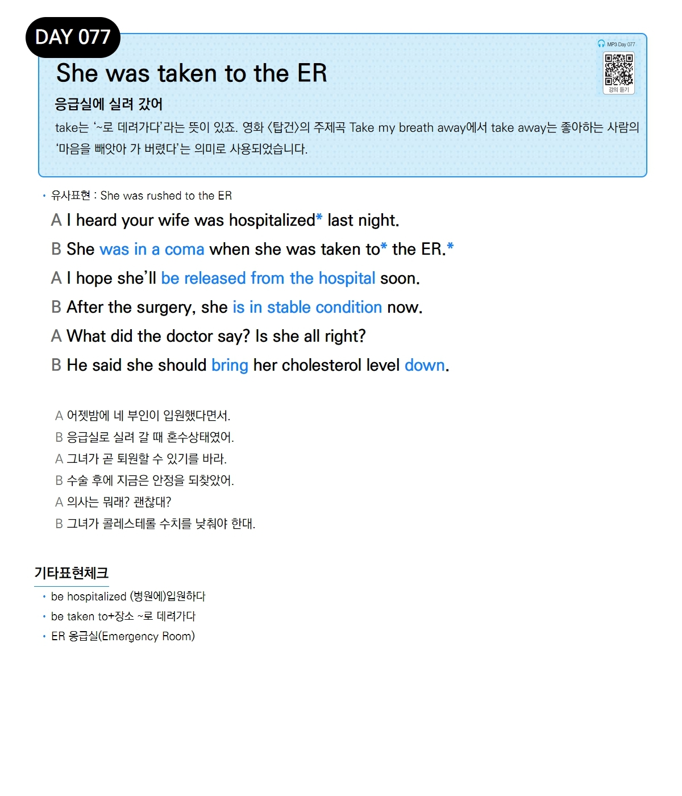

# Day 077 — She was taken to the ER

> **응급실에 실려 갔어**

## 설명
take는 '~로 데려가다'라는 뜻이 있죠. 영화 〈탑건〉의 주제곡 Take my breath away에서 take away는 좋아하는 사람의 '마음을 빼앗아 가 버렸다'는 의미로 사용되었습니다.

- **유사표현**: She was rushed to the ER

## 대화

| | English | 한국어 |
|---|---------|--------|
| A | I heard your wife was hospitalized last night. | 어젯밤에 네 부인이 입원했다면서. |
| B | She was in a coma when she was taken to the ER. | 응급실로 실려 갈 때 혼수상태였어. |
| A | I hope she'll be released from the hospital soon. | 그녀가 곧 퇴원할 수 있기를 바라. |
| B | After the surgery, she is in stable condition now. | 수술 후에 지금은 안정을 되찾았어. |
| A | What did the doctor say? Is she all right? | 의사는 뭐래? 괜찮대? |
| B | He said she should bring her cholesterol level down. | 그녀가 콜레스테롤 수치를 낮춰야 한대. |

## 기타표현 체크
- **be hospitalized** (병원에)입원하다
- **be taken to+장소** ~로 데려가다
- **ER** 응급실(Emergency Room)
