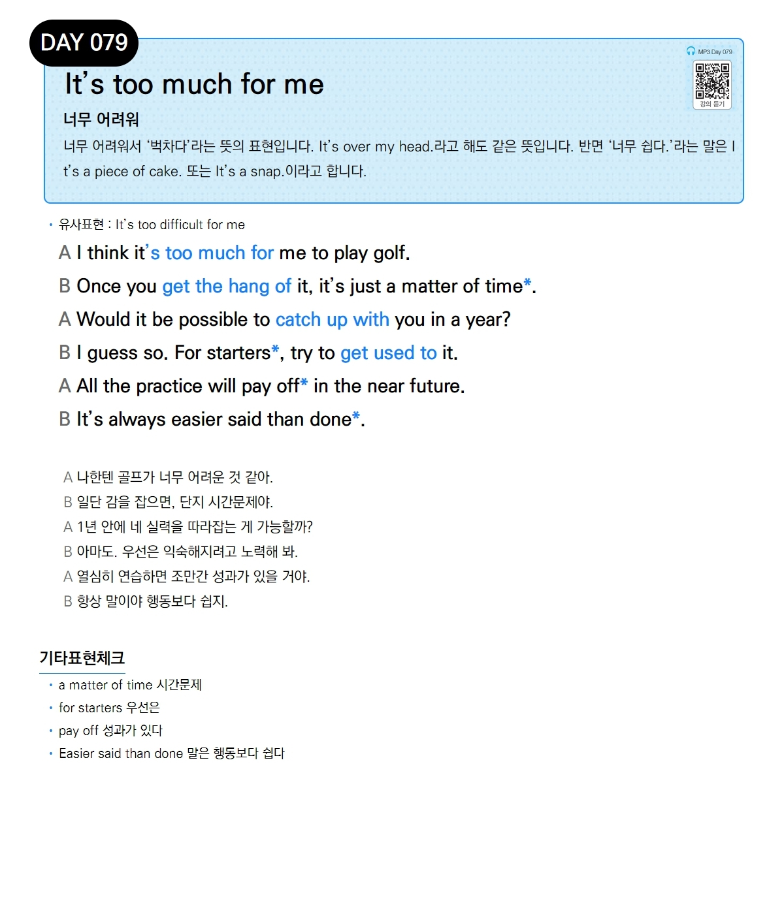

# Day 079 — It's too much for me

> **너무 어려워**

## 설명
너무 어려워서 '벅차다'라는 뜻의 표현입니다. `It's over my head.`라고 해도 같은 뜻입니다. 반면 '너무 쉽다.'라는 말은 `It's a piece of cake.` 또는 `It's a snap.`이라고 합니다.

- **유사표현**: It's too difficult for me

## 대화

| | English | 한국어 |
|---|---------|--------|
| A | I think it's too much for me to play golf. | 나한텐 골프가 너무 어려운 것 같아. |
| B | Once you get the hang of it, it's just a matter of time. | 일단 감을 잡으면, 단지 시간문제야. |
| A | Would it be possible to catch up with you in a year? | 1년 안에 네 실력을 따라잡는 게 가능할까? |
| B | I guess so. For starters, try to get used to it. | 아마도. 우선은 익숙해지려고 노력해 봐. |
| A | All the practice will pay off in the near future. | 열심히 연습하면 조만간 성과가 있을 거야. |
| B | It's always easier said than done. | 항상 말이야 행동보다 쉽지. |

## 기타표현 체크
- **a matter of time** 시간문제
- **for starters** 우선은
- **pay off** 성과가 있다
- **Easier said than done** 말은 행동보다 쉽다
