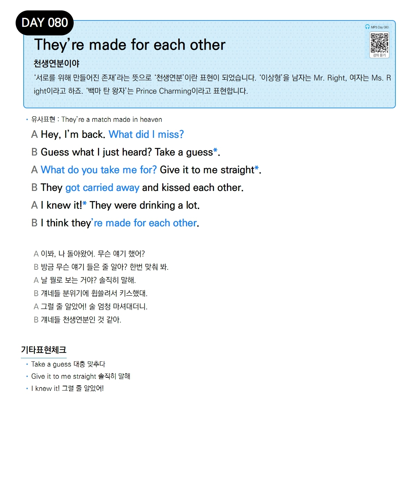

# Day 080 — They're made for each other

> **천생연분이야**

## 설명
'서로를 위해 만들어진 존재'라는 뜻으로 '천생연분'이란 표현이 되었습니다. '이상형'을 남자는 `Mr. Right`, 여자는 `Ms. Right`이라고 하죠. '백마 탄 왕자'는 `Prince Charming`이라고 표현합니다.

- **유사표현**: They're a match made in heaven

## 대화

| | English | 한국어 |
|---|---------|--------|
| A | Hey, I'm back. What did I miss? | 이봐, 나 돌아왔어. 무슨 얘기 했어? |
| B | Guess what I just heard? Take a guess. | 방금 무슨 얘기 들은 줄 알아? 한번 맞춰 봐. |
| A | What do you take me for? Give it to me straight. | 날 뭘로 보는 거야? 솔직히 말해. |
| B | They got carried away and kissed each other. | 걔네들 분위기에 휩쓸려서 키스했대. |
| A | I knew it! They were drinking a lot. | 그럴 줄 알았어! 술 엄청 마셔대더니. |
| B | I think they're made for each other. | 걔네들 천생연분인 것 같아. |

## 기타표현 체크
- **Take a guess** 대충 맞추다
- **Give it to me straight** 솔직히 말해
- **I knew it!** 그럴 줄 알았어!
