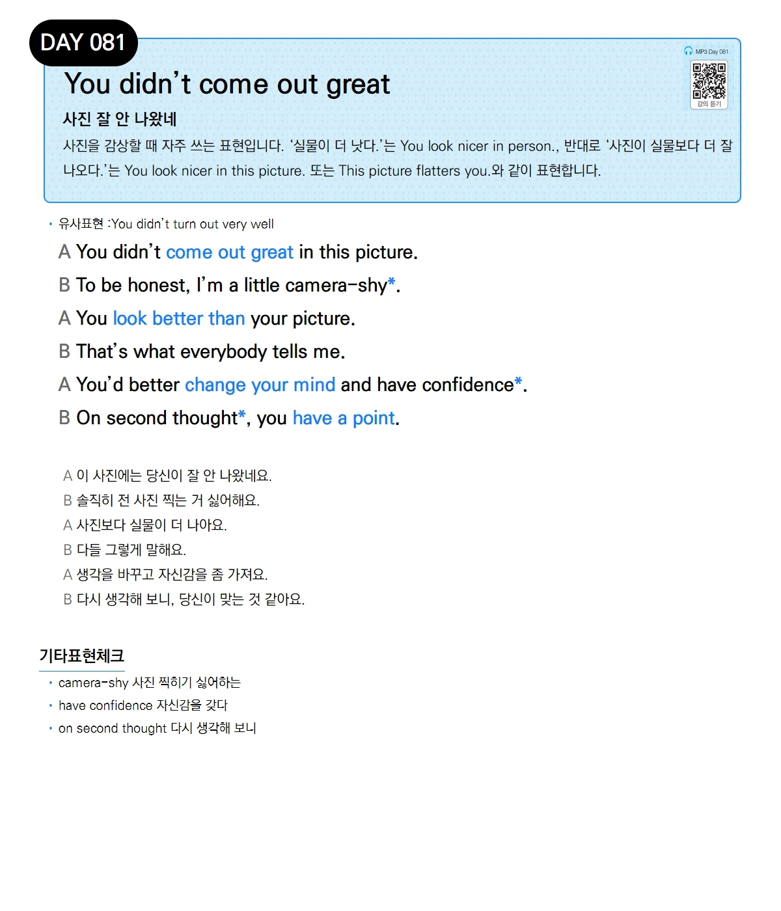

# Day 081 — You didn't come out great

> **사진 잘 안 나왔네**

## 설명
사진을 감상할 때 자주 쓰는 표현입니다. '실물이 더 낫다.'는 `You look nicer in person.`, 반대로 '사진이 실물보다 더 잘 나오다.'는 `You look nicer in this picture.` 또는 `This picture flatters you.`와 같이 표현합니다.

- **유사표현**: You didn't turn out very well

## 대화

| | English | 한국어 |
|---|---------|--------|
| A | You didn't come out great in this picture. | 이 사진에는 당신이 잘 안 나왔네요. |
| B | To be honest, I'm a little camera-shy. | 솔직히 전 사진 찍는 거 싫어해요. |
| A | You look better than your picture. | 사진보다 실물이 더 나아요. |
| B | That's what everybody tells me. | 다들 그렇게 말해요. |
| A | You'd better change your mind and have confidence. | 생각을 바꾸고 자신감을 좀 가져요. |
| B | On second thought, you have a point. | 다시 생각해 보니, 당신이 맞는 것 같아요. |

## 기타표현 체크
- **camera-shy** 사진 찍히기 싫어하는
- **have confidence** 자신감을 갖다
- **on second thought** 다시 생각해 보니
