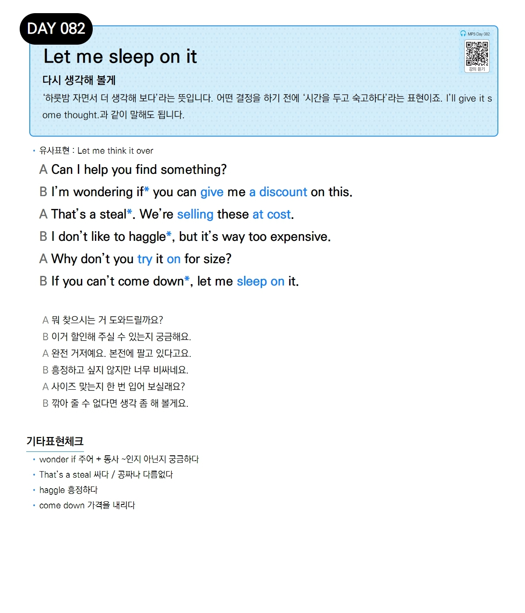

# Day 082 — Let me sleep on it

> **다시 생각해 볼게**

## 설명
'하룻밤 자면서 더 생각해 보다'라는 뜻입니다. 어떤 결정을 하기 전에 '시간을 두고 숙고하다'라는 표현이죠. `I'll give it some thought.`과 같이 말해도 됩니다.

- **유사표현**: Let me think it over

## 대화

| | English | 한국어 |
|---|---------|--------|
| A | Can I help you find something? | 뭐 찾으시는 거 도와드릴까요? |
| B | I'm wondering if you can give me a discount on this. | 이거 할인해 주실 수 있는지 궁금해요. |
| A | That's a steal. We're selling these at cost. | 완전 거저예요. 본전에 팔고 있다고요. |
| B | I don't like to haggle, but it's way too expensive. | 흥정하고 싶지 않지만 너무 비싸네요. |
| A | Why don't you try it on for size? | 사이즈 맞는지 한 번 입어 보실래요? |
| B | If you can't come down, let me sleep on it. | 깎아 줄 수 없다면 생각 좀 해 볼게요. |

## 기타표현 체크
- **wonder if 주어 + 동사** ~인지 아닌지 궁금하다
- **That's a steal** 싸다 / 공짜나 다름없다
- **haggle** 흥정하다
- **come down** 가격을 내리다
