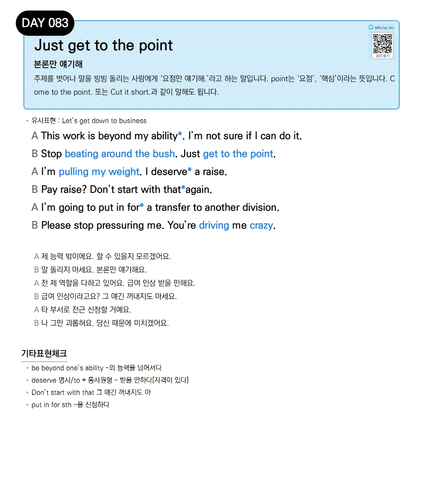

# Day 083 — Just get to the point

> **본론만 얘기해**

## 설명
주제를 벗어나 말을 빙빙 돌리는 사람에게 '요점만 얘기해.'라고 하는 말입니다. point는 '요점', '핵심'이라는 뜻입니다. Come to the point. 또는 Cut it short.과 같이 말해도 됩니다.

- **유사표현**: Let's get down to business

## 대화

| | English | 한국어 |
|---|---------|--------|
| A | This work is beyond my ability. I'm not sure if I can do it. | 제 능력 밖이에요. 할 수 있을지 모르겠어요. |
| B | Stop beating around the bush. Just get to the point. | 말 돌리지 마세요. 본론만 얘기해요. |
| A | I'm pulling my weight. I deserve a raise. | 전 제 역할을 다하고 있어요. 급여 인상 받을 만해요. |
| B | Pay raise? Don't start with that again. | 급여 인상이라고요? 그 얘긴 꺼내지도 마세요. |
| A | I'm going to put in for a transfer to another division. | 타 부서로 전근 신청할 거예요. |
| B | Please stop pressuring me. You're driving me crazy. | 나 그만 괴롭혀요. 당신 때문에 미치겠어요. |

## 기타표현 체크
- **be beyond one's ability** ~의 능력을 넘어서다
- **deserve 명사/to + 동사원형** ~ 받을 만하다[자격이 있다]
- **Don't start with that** 그 얘긴 꺼내지도 마
- **put in for sth** ~을 신청하다
