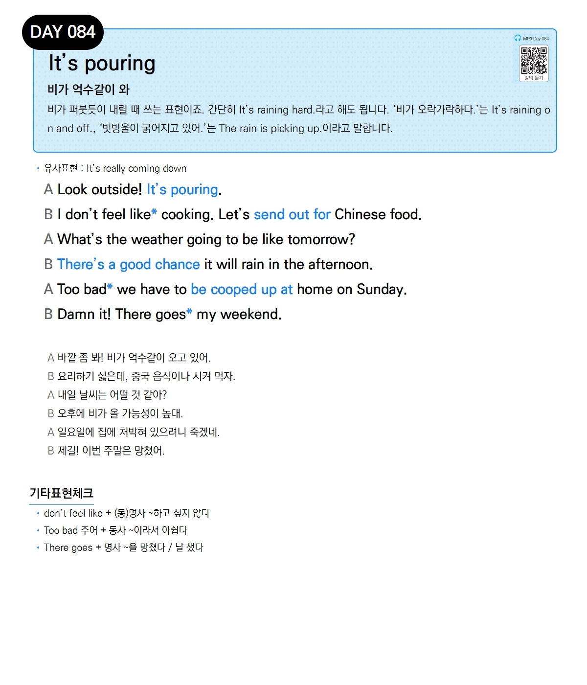

# Day 084 — It's pouring

> **비가 억수같이 와**

## 설명
비가 퍼붓듯이 내릴 때 쓰는 표현이죠. 간단히 It's raining hard.라고 해도 됩니다. '비가 오락가락하다.'는 It's raining on and off., '빗방울이 굵어지고 있어.'는 The rain is picking up.이라고 말합니다.

- **유사표현**: It's really coming down

## 대화

| | English | 한국어 |
|---|---------|--------|
| A | Look outside! It's pouring. | 바깥 좀 봐! 비가 억수같이 오고 있어. |
| B | I don't feel like cooking. Let's send out for Chinese food. | 요리하기 싫은데, 중국 음식이나 시켜 먹자. |
| A | What's the weather going to be like tomorrow? | 내일 날씨는 어떨 것 같아? |
| B | There's a good chance it will rain in the afternoon. | 오후에 비가 올 가능성이 높대. |
| A | Too bad we have to be cooped up at home on Sunday. | 일요일에 집에 처박혀 있으려니 죽겠네. |
| B | Damn it! There goes my weekend. | 제길! 이번 주말은 망쳤어. |

## 기타표현 체크
- **don't feel like + (동)명사** ~하고 싶지 않다
- **Too bad 주어 + 동사** ~이라서 아쉽다
- **There goes + 명사** ~을 망쳤다 / 날 샜다
