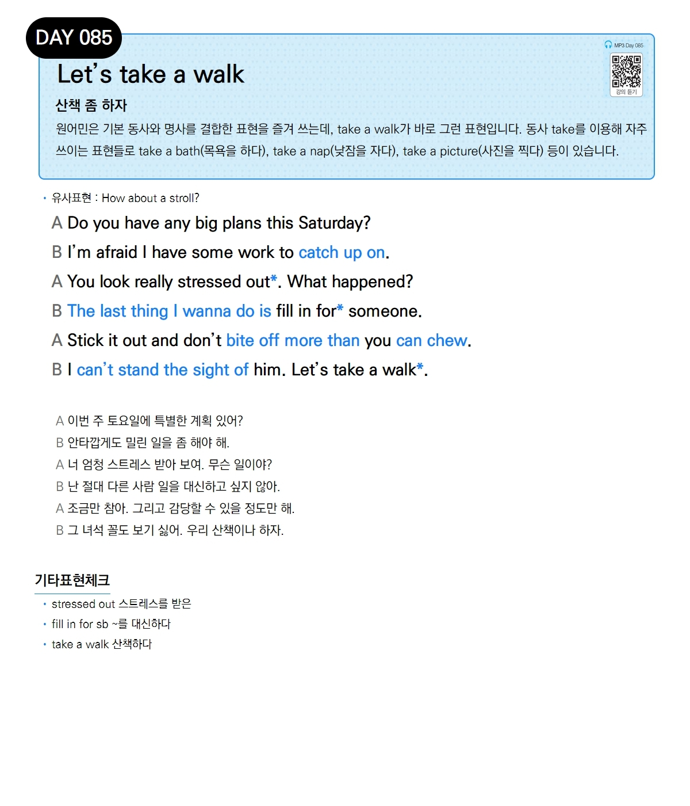

# Day 085 — Let's take a walk

> **산책 좀 하자**

## 설명
원어민은 기본 동사와 명사를 결합한 표현을 즐겨 쓰는데, take a walk가 바로 그런 표현입니다. 동사 take를 이용해 자주 쓰이는 표현들로 take a bath(목욕을 하다), take a nap(낮잠을 자다), take a picture(사진을 찍다) 등이 있습니다.

- **유사표현**: How about a stroll?

## 대화

| | English | 한국어 |
|---|---------|--------|
| A | Do you have any big plans this Saturday? | 이번 주 토요일에 특별한 계획 있어? |
| B | I'm afraid I have some work to catch up on. | 안타깝게도 밀린 일을 좀 해야 해. |
| A | You look really stressed out. What happened? | 너 엄청 스트레스 받아 보여. 무슨 일이야? |
| B | The last thing I wanna do is fill in for someone. | 난 절대 다른 사람 일을 대신하고 싶지 않아. |
| A | Stick it out and don't bite off more than you can chew. | 조금만 참아. 그리고 감당할 수 있을 정도만 해. |
| B | I can't stand the sight of him. Let's take a walk. | 그 녀석 꼴도 보기 싫어. 우리 산책이나 하자. |

## 기타표현 체크
- **stressed out** 스트레스를 받은
- **fill in for sb** ~를 대신하다
- **take a walk** 산책하다
