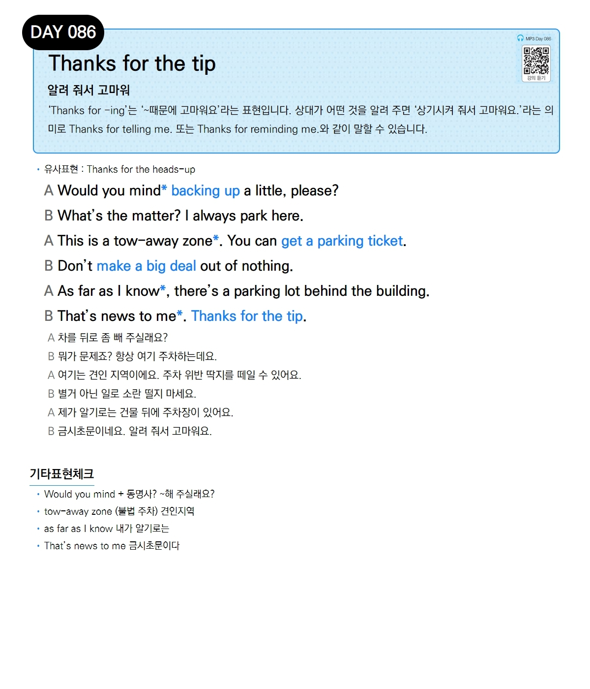

# Day 086 — Thanks for the tip

> **알려 줘서 고마워**

## 설명
'Thanks for -ing'는 '~때문에 고마워요'라는 표현입니다. 상대가 어떤 것을 알려 주면 '상기시켜 줘서 고마워요.'라는 의미로 Thanks for telling me. 또는 Thanks for reminding me.와 같이 말할 수 있습니다.

- **유사표현**: Thanks for the heads-up

## 대화

| | English | 한국어 |
|---|---------|--------|
| A | Would you mind backing up a little, please? | 차를 뒤로 좀 빼 주실래요? |
| B | What's the matter? I always park here. | 뭐가 문제죠? 항상 여기 주차하는데요. |
| A | This is a tow-away zone. You can get a parking ticket. | 여기는 견인 지역이에요. 주차 위반 딱지를 떼일 수 있어요. |
| B | Don't make a big deal out of nothing. | 별거 아닌 일로 소란 떨지 마세요. |
| A | As far as I know, there's a parking lot behind the building. | 제가 알기로는 건물 뒤에 주차장이 있어요. |
| B | That's news to me. Thanks for the tip. | 금시초문이네요. 알려 줘서 고마워요. |

## 기타표현 체크
- **Would you mind + 동명사?** ~해 주실래요?
- **tow-away zone** (불법 주차) 견인지역
- **as far as I know** 내가 알기로는
- **That's news to me** 금시초문이다
