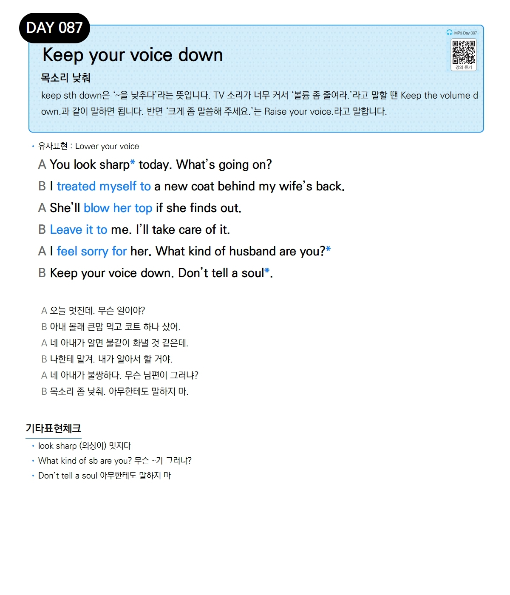

# Day 087 — Keep your voice down

> **목소리 낮춰**

## 설명
keep sth down은 '~을 낮추다'라는 뜻입니다. TV 소리가 너무 커서 '볼륨 좀 줄여라.'라고 말할 땐 Keep the volume down.과 같이 말하면 됩니다. 반면 '크게 좀 말씀해 주세요.'는 Raise your voice.라고 말합니다.

- **유사표현**: Lower your voice

## 대화

| | English | 한국어 |
|---|---------|--------|
| A | You look sharp today. What's going on? | 오늘 멋진데. 무슨 일이야? |
| B | I treated myself to a new coat behind my wife's back. | 아내 몰래 큰맘 먹고 코트 하나 샀어. |
| A | She'll blow her top if she finds out. | 네 아내가 알면 불같이 화낼 것 같은데. |
| B | Leave it to me. I'll take care of it. | 나한테 맡겨. 내가 알아서 할 거야. |
| A | I feel sorry for her. What kind of husband are you? | 네 아내가 불쌍하다. 무슨 남편이 그러냐? |
| B | Keep your voice down. Don't tell a soul. | 목소리 좀 낮춰. 아무한테도 말하지 마. |

## 기타표현 체크
- **look sharp** (의상이) 멋지다
- **What kind of sb are you?** 무슨 ~가 그러냐?
- **Don't tell a soul** 아무한테도 말하지 마
