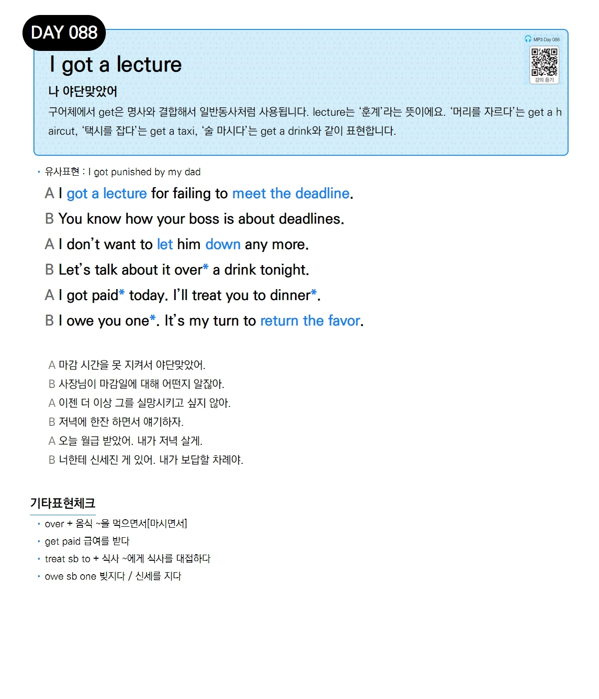

# Day 088 — I got a lecture

> **나 야단맞았어**

## 설명
구어체에서 get은 명사와 결합해서 일반동사처럼 사용됩니다. lecture는 '훈계'라는 뜻이에요. '머리를 자르다'는 get a haircut, '택시를 잡다'는 get a taxi, '술 마시다'는 get a drink와 같이 표현합니다.

- **유사표현**: I got punished by my dad

## 대화

| | English | 한국어 |
|---|---------|--------|
| A | I got a lecture for failing to meet the deadline. | 마감 시간을 못 지켜서 야단맞았어. |
| B | You know how your boss is about deadlines. | 사장님이 마감일에 대해 어떤지 알잖아. |
| A | I don't want to let him down any more. | 이젠 더 이상 그를 실망시키고 싶지 않아. |
| B | Let's talk about it over a drink tonight. | 저녁에 한잔 하면서 얘기하자. |
| A | I got paid today. I'll treat you to dinner. | 오늘 월급 받았어. 내가 저녁 살게. |
| B | I owe you one. It's my turn to return the favor. | 너한테 신세진 게 있어. 내가 보답할 차례야. |

## 기타표현 체크
- **over + 음식** ~을 먹으면서[마시면서]
- **get paid** 급여를 받다
- **treat sb to + 식사** ~에게 식사를 대접하다
- **owe sb one** 빚지다 / 신세를 지다
