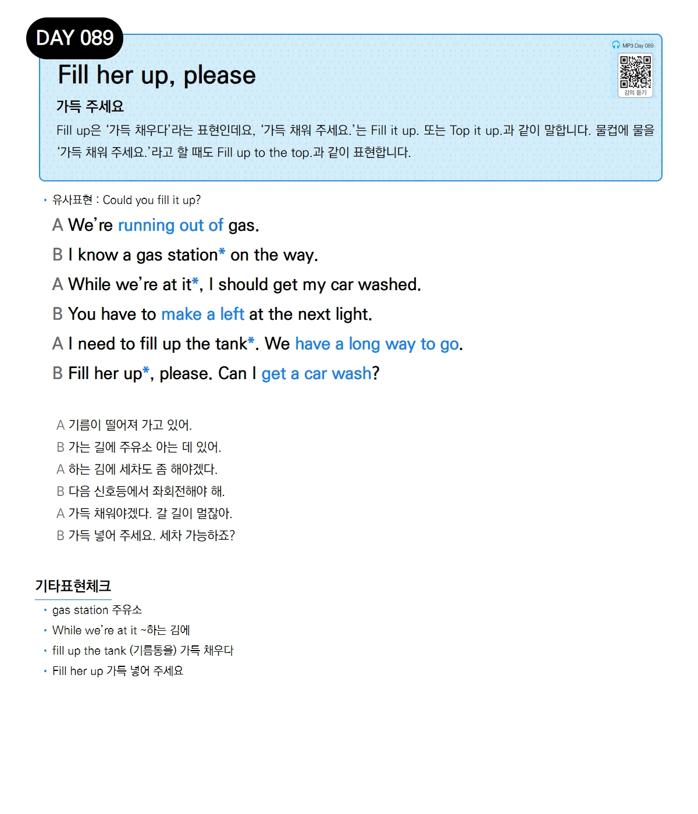

# Day 089 — Fill her up, please

> **가득 주세요**

## 설명
Fill up은 '가득 채우다'라는 표현인데요, '가득 채워 주세요.'는 Fill it up. 또는 Top it up.과 같이 말합니다. 물컵에 물을 '가득 채워 주세요.'라고 할 때도 Fill up to the top.과 같이 표현합니다.

- **유사표현**: Could you fill it up?

## 대화

| | English | 한국어 |
|---|---------|--------|
| A | We're running out of gas. | 기름이 떨어져 가고 있어. |
| B | I know a gas station on the way. | 가는 길에 주유소 아는 데 있어. |
| A | While we're at it, I should get my car washed. | 하는 김에 세차도 좀 해야겠어. |
| B | You have to make a left at the next light. | 다음 신호등에서 좌회전해야 해. |
| A | I need to fill up the tank. We have a long way to go. | 가득 채워야겠다. 갈 길이 멀잖아. |
| B | Fill her up, please. Can I get a car wash? | 가득 넣어 주세요. 세차 가능하죠? |

## 기타표현 체크
- **gas station** 주유소
- **While we're at it** ~하는 김에
- **fill up the tank** (기름통을) 가득 채우다
- **Fill her up** 가득 넣어 주세요
