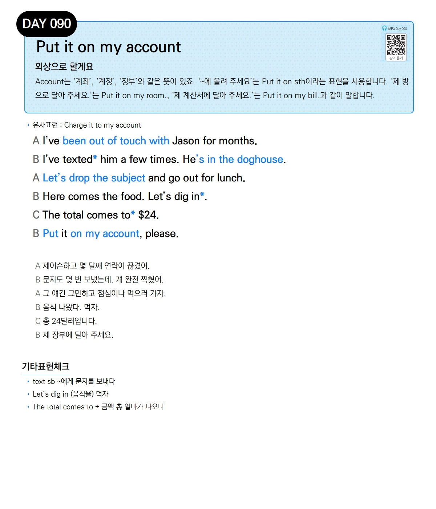

# Day 090 — Put it on my account

> **외상으로 할게요**

## 설명
Account는 '계좌', '계정', '장부'와 같은 뜻이 있죠. '~에 올려 주세요'는 Put it on sth이라는 표현을 사용합니다. '제 방으로 달아 주세요.'는 Put it on my room., '제 계산서에 달아 주세요.'는 Put it on my bill.과 같이 말합니다.

- **유사표현**: Charge it to my account

## 대화

| | English | 한국어 |
|---|---------|--------|
| A | I've been out of touch with Jason for months. | 제이슨하고 몇 달째 연락이 끊겼어. |
| B | I've texted him a few times. He's in the doghouse. | 문자도 몇 번 보냈는데. 걔 완전 찍혔어. |
| A | Let's drop the subject and go out for lunch. | 그 얘긴 그만하고 점심이나 먹으러 가자. |
| B | Here comes the food. Let's dig in. | 음식 나왔다. 먹자. |
| C | The total comes to $24. | 총 24달러입니다. |
| B | Put it on my account, please. | 제 장부에 달아 주세요. |

## 기타표현 체크
- **text sb** ~에게 문자를 보내다
- **Let's dig in** (음식을) 먹자
- **The total comes to + 금액** 총 얼마가 나오다
