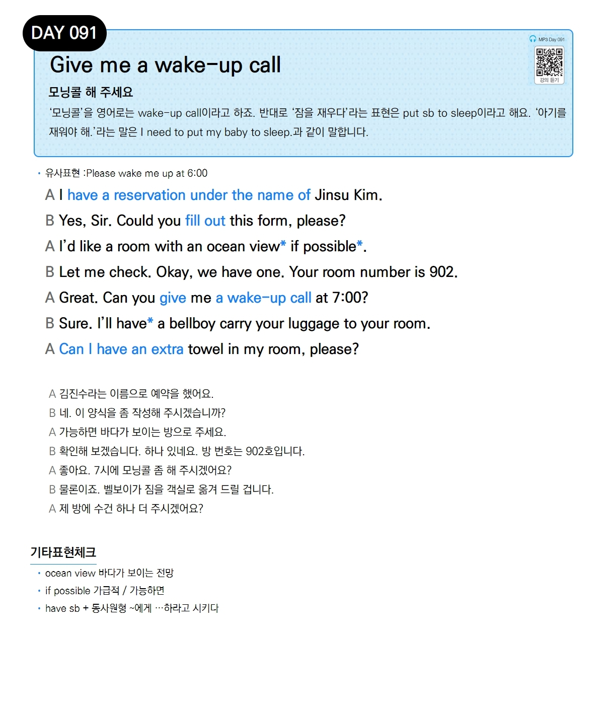

# Day 091 — Give me a wake-up call

> **모닝콜 해 주세요**

## 설명
'모닝콜'을 영어로는 wake-up call이라고 하죠. 반대로 '잠을 재우다'라는 표현은 put sb to sleep이라고 해요. '아기를 재워야 해.'라는 말은 I need to put my baby to sleep.과 같이 말합니다.

- **유사표현**: Please wake me up at 6:00

## 대화

| | English | 한국어 |
|---|---------|--------|
| A | I have a reservation under the name of Jinsu Kim. | 김진수라는 이름으로 예약을 했어요. |
| B | Yes, Sir. Could you fill out this form, please? | 네. 이 양식을 좀 작성해 주시겠습니까? |
| A | I'd like a room with an ocean view if possible. | 가능하면 바다가 보이는 방으로 주세요. |
| B | Let me check. Okay, we have one. Your room number is 902. | 확인해 보겠습니다. 하나 있네요. 방 번호는 902호입니다. |
| A | Great. Can you give me a wake-up call at 7:00? | 좋아요. 7시에 모닝콜 좀 해 주시겠어요? |
| B | Sure. I'll have a bellboy carry your luggage to your room. | 물론이죠. 벨보이가 짐을 객실로 옮겨 드릴 겁니다. |
| A | Can I have an extra towel in my room, please? | 제 방에 수건 하나 더 주시겠어요? |

## 기타표현 체크
- **ocean view** 바다가 보이는 전망
- **if possible** 가급적 / 가능하면
- **have sb + 동사원형** ~에게 …하라고 시키다
