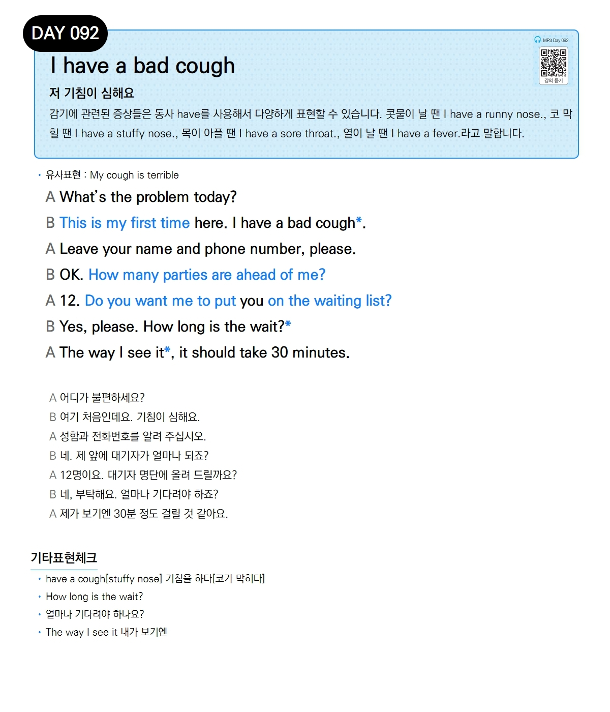

# Day 092 — I have a bad cough

> **저 기침이 심해요**

## 설명
감기에 관련된 증상들은 동사 `have`를 사용해서 다양하게 표현할 수 있습니다. 콧물이 날 땐 `I have a runny nose.`, 코 막힐 땐 `I have a stuffy nose.`, 목이 아플 땐 `I have a sore throat.`, 열이 날 땐 `I have a fever.`라고 말합니다.

- **유사표현**: My cough is terrible

## 대화

| | English | 한국어 |
|---|---------|--------|
| A | What's the problem today? | 어디가 불편하세요? |
| B | This is my first time here. I have a bad cough. | 여기 처음인데요. 기침이 심해요. |
| A | Leave your name and phone number, please. | 성함과 전화번호를 알려 주십시오. |
| B | OK. How many parties are ahead of me? | 네. 제 앞에 대기자가 얼마나 되죠? |
| A | 12. Do you want me to put you on the waiting list? | 12명이요. 대기자 명단에 올려 드릴까요? |
| B | Yes, please. How long is the wait? | 네, 부탁해요. 얼마나 기다려야 하죠? |
| A | The way I see it, it should take 30 minutes. | 제가 보기엔 30분 정도 걸릴 것 같아요. |

## 기타표현 체크
- **have a cough[stuffy nose]** 기침을 하다[코가 막히다]
- **How long is the wait?** 얼마나 기다려야 하나요?
- **The way I see it** 내가 보기엔
