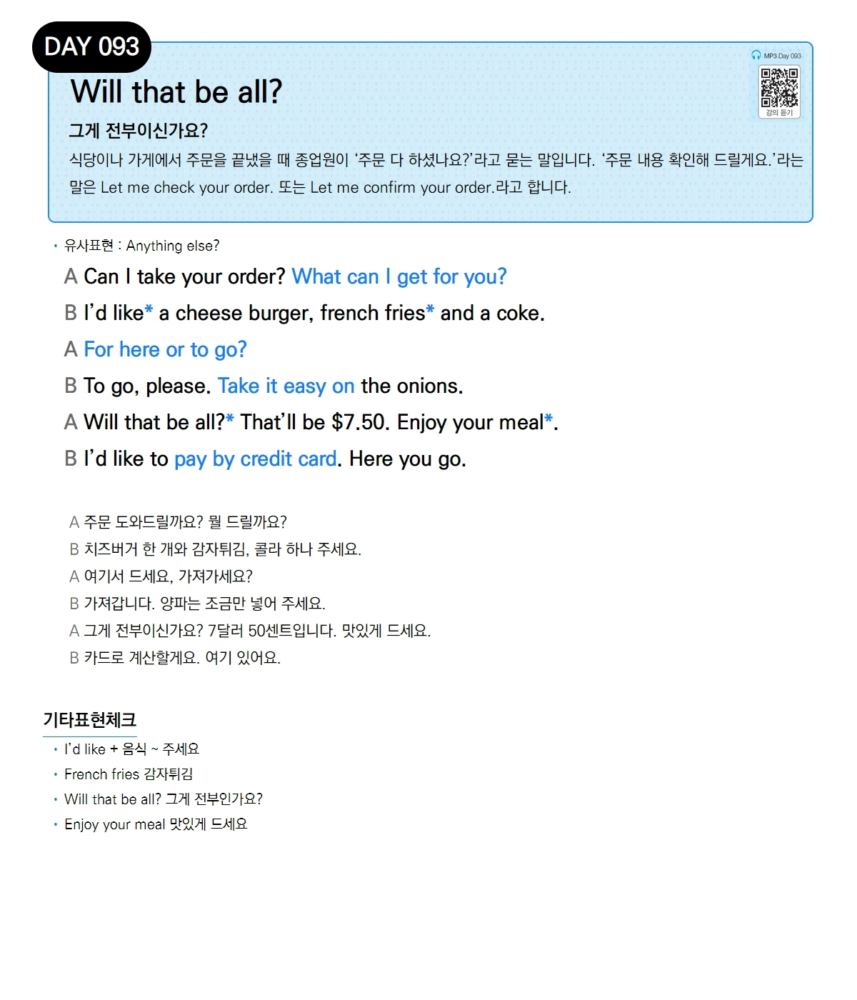

# Day 093 — Will that be all?

> **그게 전부이신가요?**

## 설명
식당이나 가게에서 주문을 끝냈을 때 종업원이 '주문 다 하셨나요?'라고 묻는 말입니다. '주문 내용 확인해 드릴게요.'라는 말은 `Let me check your order.` 또는 `Let me confirm your order.`라고 합니다.

- **유사표현**: Anything else?

## 대화

| | English | 한국어 |
|---|---------|--------|
| A | Can I take your order? What can I get for you? | 주문 도와드릴까요? 뭘 드릴까요? |
| B | I'd like a cheese burger, french fries and a coke. | 치즈버거 한 개와 감자튀김, 콜라 하나 주세요. |
| A | For here or to go? | 여기서 드세요, 가져가세요? |
| B | To go, please. Take it easy on the onions. | 가져갑니다. 양파는 조금만 넣어 주세요. |
| A | Will that be all? That'll be $7.50. Enjoy your meal. | 그게 전부이신가요? 7달러 50센트입니다. 맛있게 드세요. |
| B | I'd like to pay by credit card. Here you go. | 카드로 계산할게요. 여기 있어요. |

## 기타표현 체크
- **I'd like + 음식** ~ 주세요
- **French fries** 감자튀김
- **Will that be all?** 그게 전부인가요?
- **Enjoy your meal** 맛있게 드세요
