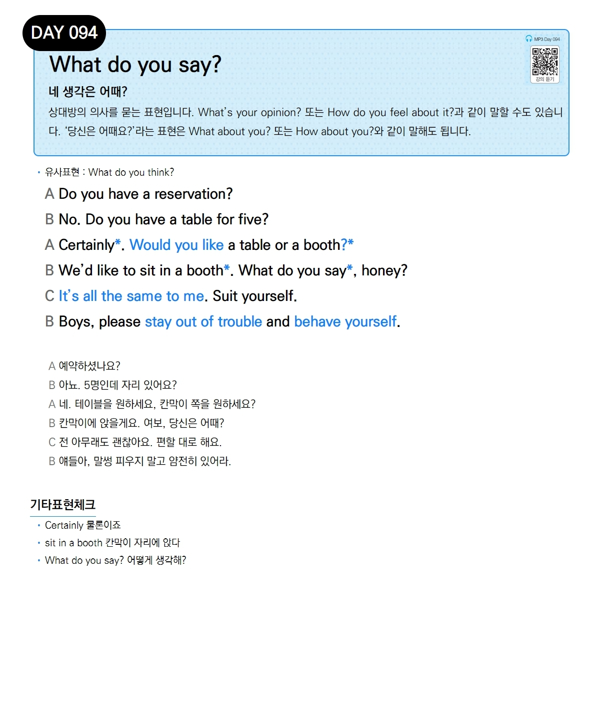

# Day 094 — What do you say?

> **네 생각은 어때?**

## 설명
상대방의 의사를 묻는 표현입니다. `What's your opinion?` 또는 `How do you feel about it?`과 같이 말할 수도 있습니다. '당신은 어때요?'라는 표현은 `What about you?` 또는 `How about you?`와 같이 말해도 됩니다.

- **유사표현**: What do you think?

## 대화

| | English | 한국어 |
|---|---------|--------|
| A | Do you have a reservation? | 예약하셨나요? |
| B | No. Do you have a table for five? | 아뇨. 5명인데 자리 있어요? |
| A | Certainly. Would you like a table or a booth? | 네. 테이블을 원하세요, 칸막이 쪽을 원하세요? |
| B | We'd like to sit in a booth. What do you say, honey? | 칸막이에 앉을게요. 여보, 당신은 어때? |
| C | It's all the same to me. Suit yourself. | 전 아무래도 괜찮아요. 편할 대로 해요. |
| B | Boys, please stay out of trouble and behave yourselves. | 얘들아, 말썽 피우지 말고 얌전히 있어라. |

## 기타표현 체크
- **Certainly** 물론이죠
- **sit in a booth** 칸막이 자리에 앉다
- **What do you say?** 어떻게 생각해?
