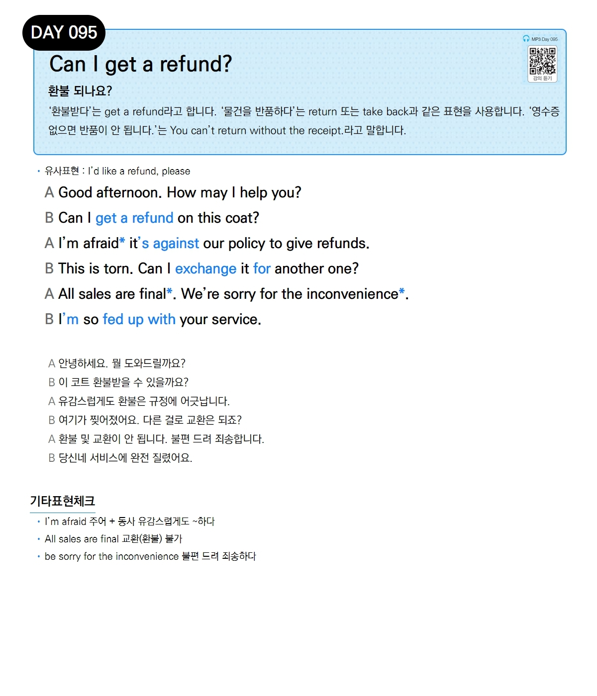

# Day 095 — Can I get a refund?

> **환불 되나요?**

## 설명
'환불받다'는 `get a refund`라고 합니다. '물건을 반품하다'는 `return` 또는 `take back`과 같은 표현을 사용합니다. '영수증 없으면 반품이 안 됩니다.'는 `You can't return without the receipt.`라고 말합니다.

- **유사표현**: I'd like a refund, please

## 대화

| | English | 한국어 |
|---|---------|--------|
| A | Good afternoon. How may I help you? | 안녕하세요. 뭘 도와드릴까요? |
| B | Can I get a refund on this coat? | 이 코트 환불받을 수 있을까요? |
| A | I'm afraid it's against our policy to give refunds. | 유감스럽게도 환불은 규정에 어긋납니다. |
| B | This is torn. Can I exchange it for another one? | 여기가 찢어졌어요. 다른 걸로 교환은 되죠? |
| A | All sales are final. We're sorry for the inconvenience. | 환불 및 교환이 안 됩니다. 불편 드려 죄송합니다. |
| B | I'm so fed up with your service. | 당신네 서비스에 완전 질렸어요. |

## 기타표현 체크
- **I'm afraid 주어 + 동사** 유감스럽게도 ~하다
- **All sales are final** 교환(환불) 불가
- **be sorry for the inconvenience** 불편 드려 죄송하다
