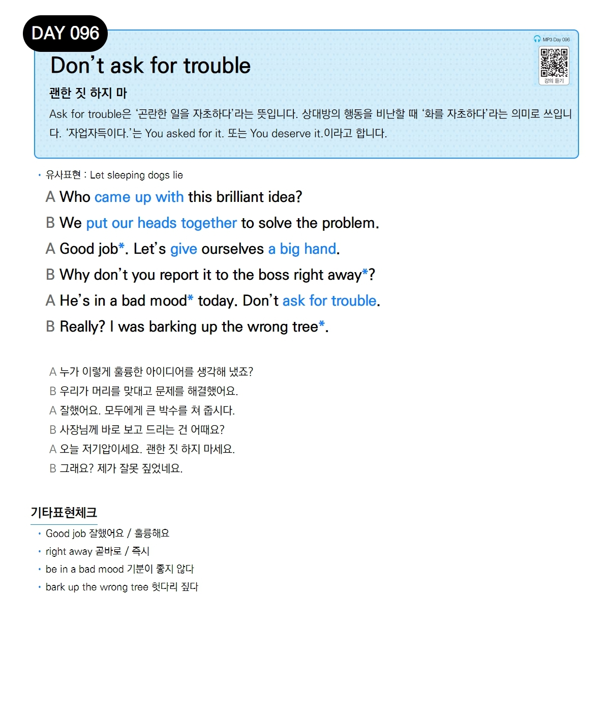

# Day 096 — Don't ask for trouble

> **괜한 짓 하지 마**

## 설명
`ask for trouble`은 '곤란한 일을 자초하다'라는 뜻입니다. 상대방의 행동을 비난할 때 '화를 자초하다'라는 의미로 쓰입니다. '자업자득이다.'는 `You asked for it.` 또는 `You deserve it.`이라고 합니다.

- **유사표현**: Let sleeping dogs lie

## 대화

| | English | 한국어 |
|---|---------|--------|
| A | Who came up with this brilliant idea? | 누가 이렇게 훌륭한 아이디어를 생각해 냈죠? |
| B | We put our heads together to solve the problem. | 우리가 머리를 맞대고 문제를 해결했어요. |
| A | Good job. Let's give ourselves a big hand. | 잘했어요. 모두에게 큰 박수를 쳐 줍시다. |
| B | Why don't you report it to the boss right away? | 사장님께 바로 보고 드리는 건 어때요? |
| A | He's in a bad mood today. Don't ask for trouble. | 오늘 저기압이세요. 괜한 짓 하지 마세요. |
| B | Really? I was barking up the wrong tree. | 그래요? 제가 잘못 짚었네요. |

## 기타표현 체크
- **Good job** 잘했어요 / 훌륭해요
- **right away** 곧바로 / 즉시
- **be in a bad mood** 기분이 좋지 않다
- **bark up the wrong tree** 헛다리 짚다
