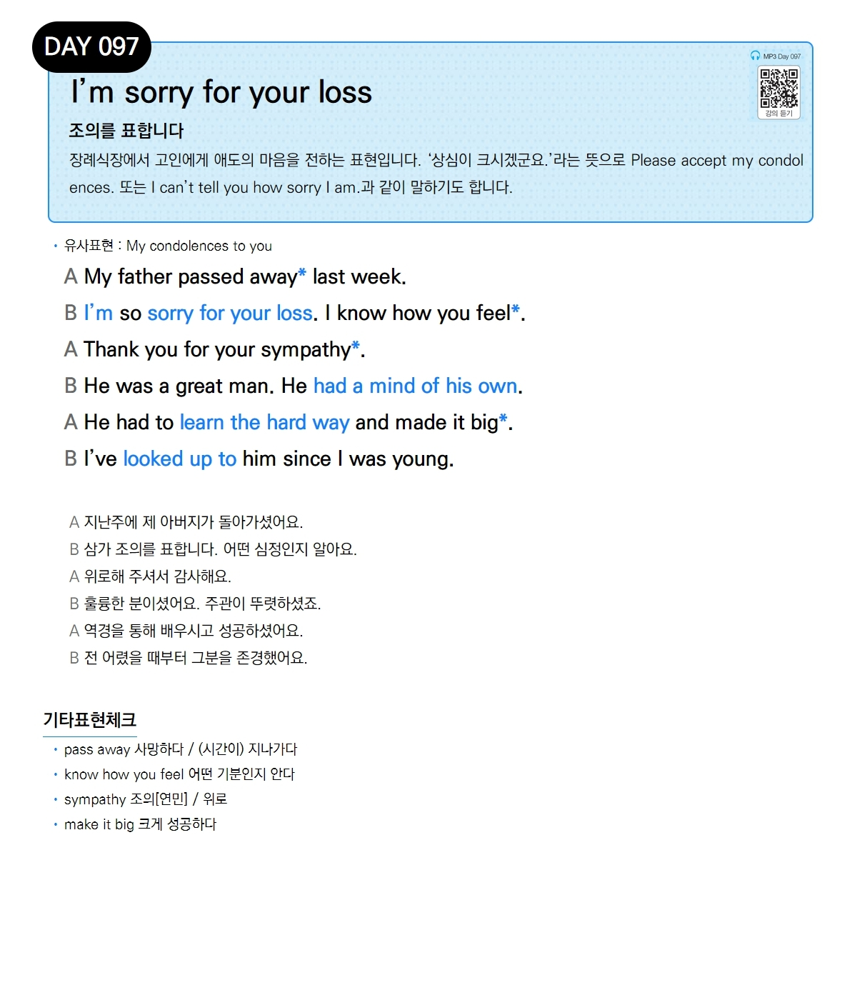

# Day 097 — I'm sorry for your loss

> **조의를 표합니다**

## 설명
장례식장에서 고인에게 애도의 마음을 전하는 표현입니다. '상심이 크시겠군요.'라는 뜻으로 `Please accept my condolences.` 또는 `I can't tell you how sorry I am.`과 같이 말하기도 합니다.

- **유사표현**: My condolences to you

## 대화

| | English | 한국어 |
|---|---------|--------|
| A | My father passed away last week. | 지난주에 제 아버지가 돌아가셨어요. |
| B | I'm so sorry for your loss. I know how you feel. | 삼가 조의를 표합니다. 어떤 심정인지 알아요. |
| A | Thank you for your sympathy. | 위로해 주셔서 감사해요. |
| B | He was a great man. He had a mind of his own. | 훌륭한 분이셨어요. 주관이 뚜렷하셨죠. |
| A | He had to learn the hard way and made it big. | 역경을 통해 배우시고 성공하셨어요. |
| B | I've looked up to him since I was young. | 전 어렸을 때부터 그분을 존경했어요. |

## 기타표현 체크
- **pass away** 사망하다 / (시간이) 지나가다
- **know how you feel** 어떤 기분인지 안다
- **sympathy** 조의[연민] / 위로
- **make it big** 크게 성공하다
