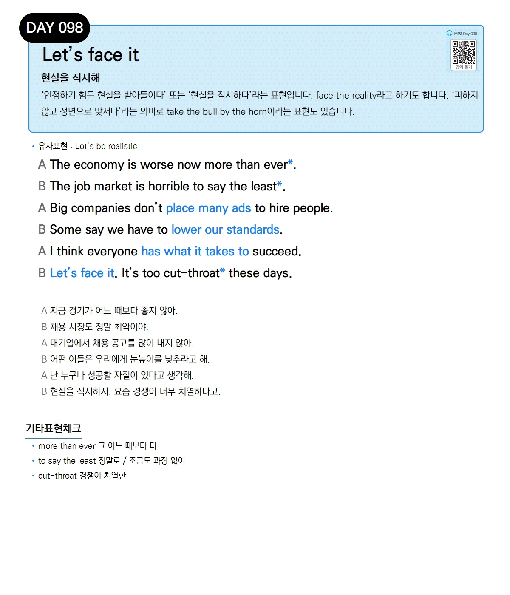

# Day 098 — Let's face it

> **현실을 직시해**

## 설명
'인정하기 힘든 현실을 받아들이다' 또는 '현실을 직시하다'라는 표현입니다. `face the reality`라고 하기도 합니다. '피하지 않고 정면으로 맞서다'라는 의미로 `take the bull by the horn`이라는 표현도 있습니다.

- **유사표현**: Let's be realistic

## 대화

| | English | 한국어 |
|---|---------|--------|
| A | The economy is worse now than ever. | 지금 경기가 어느 때보다 좋지 않아. |
| B | The job market is horrible to say the least. | 채용 시장도 정말 최악이야. |
| A | Big companies don't place many ads to hire people. | 대기업에서 채용 공고를 많이 내지 않아. |
| B | Some say we have to lower our standards. | 어떤 이들은 우리에게 눈높이를 낮추라고 해. |
| A | I think everyone has what it takes to succeed. | 난 누구나 성공할 자질이 있다고 생각해. |
| B | Let's face it. It's too cut-throat these days. | 현실을 직시하자. 요즘 경쟁이 너무 치열하다고. |

## 기타표현 체크
- **more than ever** 그 어느 때보다 더
- **to say the least** 정말로 / 조금도 과장 없이
- **cut-throat** 경쟁이 치열한
