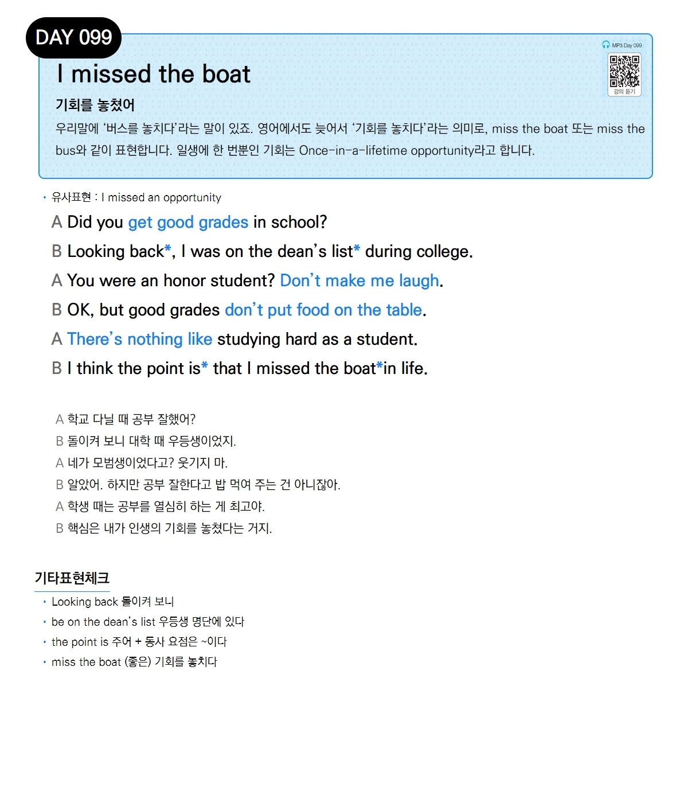

# Day 099 — I missed the boat

> **기회를 놓쳤어**

## 설명
우리말에 '버스를 놓치다'라는 말이 있죠. 영어에서도 늦어서 '기회를 놓치다'라는 의미로, `miss the boat` 또는 `miss the bus`와 같이 표현합니다. 일생에 한 번뿐인 기회는 `Once-in-a-lifetime opportunity`라고 합니다.

- **유사표현**: I missed an opportunity

## 대화

| | English | 한국어 |
|---|---------|--------|
| A | Did you get good grades in school? | 학교 다닐 때 공부 잘했어? |
| B | Looking back, I was on the dean's list during college. | 돌이켜 보니 대학 때 우등생이었지. |
| A | You were an honor student? Don't make me laugh. | 네가 모범생이었다고? 웃기지 마. |
| B | OK, but good grades don't put food on the table. | 알았어. 하지만 공부 잘한다고 밥 먹여 주는 건 아니잖아. |
| A | There's nothing like studying hard as a student. | 학생 때는 공부를 열심히 하는 게 최고야. |
| B | I think the point is that I missed the boat in life. | 핵심은 내가 인생의 기회를 놓쳤다는 거지. |

## 기타표현 체크
- **Looking back** 돌이켜 보니
- **be on the dean's list** 우등생 명단에 있다
- **the point is 주어 + 동사** 요점은 ~이다
- **miss the boat** (좋은) 기회를 놓치다
