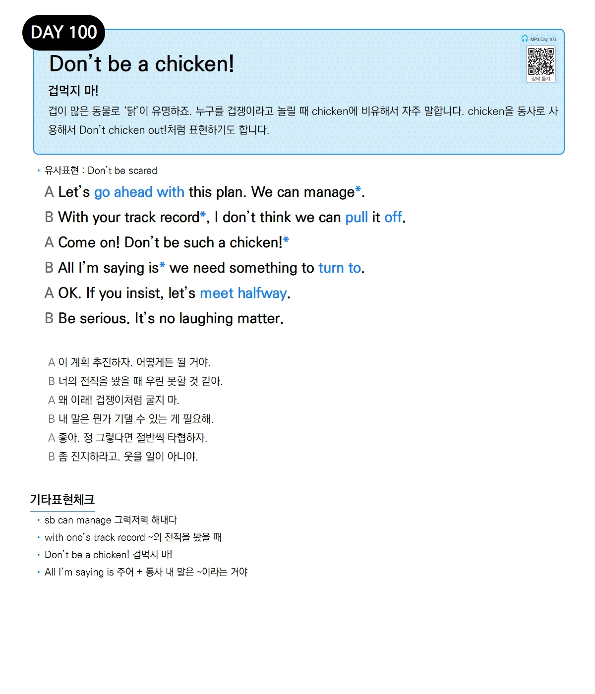

# Day 100 — Don't be a chicken!

> **겁먹지 마!**

## 설명
겁이 많은 동물로 '닭'이 유명하죠. 누구를 겁쟁이라고 놀릴 때 `chicken`에 비유해서 자주 말합니다. `chicken`을 동사로 사용해서 `Don't chicken out!`처럼 표현하기도 합니다.

- **유사표현**: Don't be scared

## 대화

| | English | 한국어 |
|---|---------|--------|
| A | Let's go ahead with this plan. We can manage. | 이 계획 추진하자. 어떻게든 될 거야. |
| B | With your track record, I don't think we can pull it off. | 너의 전적을 봤을 때 우린 못할 것 같아. |
| A | Come on! Don't be such a chicken! | 왜 이래! 겁쟁이처럼 굴지 마. |
| B | All I'm saying is we need something to turn to. | 내 말은 뭔가 기댈 수 있는 게 필요해. |
| A | OK. If you insist, let's meet halfway. | 좋아. 정 그렇다면 절반씩 타협하자. |
| B | Be serious. It's no laughing matter. | 좀 진지하라고. 웃을 일이 아니야. |

## 기타표현 체크
- **sb can manage** 그럭저럭 해내다
- **with one's track record** ~의 전적을 봤을 때
- **Don't be a chicken!** 겁먹지 마!
- **All I'm saying is 주어 + 동사** 내 말은 ~이라는 거야
